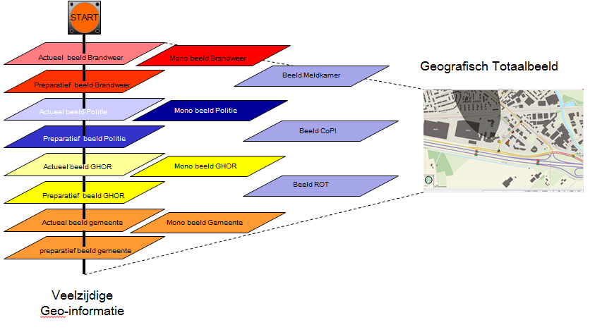

## 1.2 Principes geografische informatie en netcentrisch werken

Het spreekwoord “één plaatje zegt meer dan 1000 woorden” geeft aan waarom naast een
tekstbeeld ook een __geografisch beeld__ gewenst is tijdens een incident. Deze behoefte
ontstaat omdat men graag een totaalbeeld wil vormen van een incident. Het totaalbeeld
bestaat uit een tekstueel beeld en een geografisch beeld.

Het proces informatiemanagement heeft als doel om een actuele overdraagbare
representatie van een grootschalig incident te geven, ter ondersteuning van het proces
leiding en coördinatie binnen de hoofdstructuur van crisisbeheersing en rampenbestrijding.
Een geografisch beeld maakt integraal onderdeel uit van deze actuele overdraagbare
representatie.

Het vormen van dit multidisciplinair geografisch beeld wordt gedaan aan de hand van de
monodisciplinaire geografische eigen beelden die opgebouwd zijn uit actuele informatie met
een geografische component en het preparatief geografisch beeld. Zie ook Figuur 2.



```
Figuur 2.

Opbouw multidisciplinair 
geografisch totaalbeeld, 
gebaseerd op het 
geografisch beeld dat door
elk monodisciplinair team
opgebouwd wordt.
```