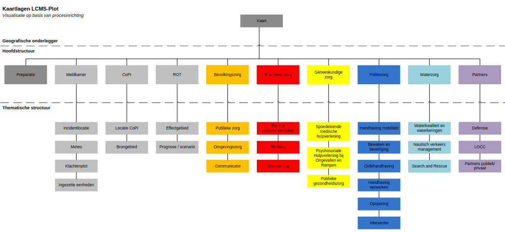

## 1.7 Plot organisatie

De visie van het netcentrisch werken is dat de bronhouder van de informatie oftewel de
producthouder van zijn monodisciplinair geografisch eigen beeld, die dit zelf deelt middels
een daarvoor bestemd crisismanagementsysteem.

Hierbij kan de opmerking gemaakt worden dat de Veiligheidsregio hier haar eigen invulling
aan mag geven zolang men maar de **minimale inhoud** op het multidisciplinaire geografisch
beeld toont. Dit geldt mede voor de functionaris die belast is met het verzorgen van dit
geografisch beeld.

In de [**stamkaart plot**](../3._Operationele_bijlagen/3_8_stamkaart_plot.md) is aangegeven worden welke informatie thuishoort op welke kaartlaag
(zie bijlage 3.9). Hiermee wordt een uniforme werkwijze bewerkstelligd in de
werkzaamheden van de geo-informatie medewerker t.b.v. rampenbestrijding en
crisisbeheersing.

#### Figuur 3. Thematische kaartlagen voor het geografisch beeld

