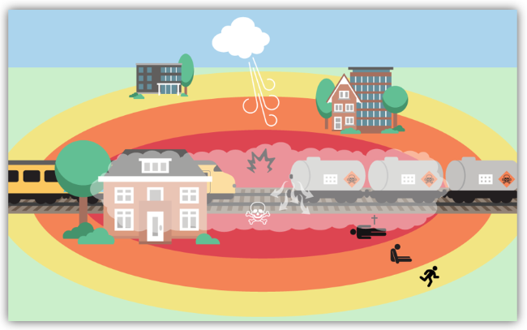

## 2.1 Samen sterk!

### Hoe werken we binnen het netwerk met elkaar samen?

Zoals beschreven in het referentiekader netcentrische crisisbeheersing bestaat een actueel
gedeeld beeld uit een tekstuele beschrijving, een geografisch beeld en een mondelinge
toelichting. Het **geografische beeld** bestaat uit verschillende kaartlagen die afkomstig zijn
van de verschillende teams binnen de hoofdstructuur, de kolommen en de crisispartners.

### Eigen beeld
Er zijn geografische multidisciplinaire eigen beelden van de meldkamer, CoPI, ROT, BT en het landelijke niveau. Daarnaast zijn er ook monodisciplinaire geografische eigen beelden waar iedere kolom leverancier is van deze gegevens. Hier staat geografische informatie in
die afkomstig vanuit de monodisciplinaire kolom, zoals bij de politie de locaties waar de afzettingen zijn geplaatst.

### Totaalbeeld
Door de kaartlagen te combineren ontstaat er een geografisch totaalbeeld. Het totaal beeld is zeer compleet en alomvattend en daardoor niet goed interpreteerbaar. Om deze reden is er een multidisciplinaire geo-informatie medewerker die een situatiebeeld oplevert.

### Situatiebeeld
Het situatiebeeld is net als bij het tekstuele beeld een samenvatting van het totaalbeeld. Het situatiebeeld geeft in één oogopslag de relevante geografische componenten van de feitelijkheden van dat moment.

### Aandacht voor multi- en monodisciplinair
Multidisciplinair, monodisciplinair en crisispartners leveren geografische gegevens aan
zoals:

- locatie incident;
- meteogegevens;
- preparatieve informatie;
- een verkeerscirculatieplan van de politie;
- resultaten van het meetplan van de brandweer;
- opvanglocaties van bevolkingszorg;
- gewondenspreidingsplan van de GHOR;
- een inundatiemodel van het waterschap (crisispartners);
- openbare bronnen;
- basisregistraties.

Het proces informatiemanagement moet zorgen dat deze gegevens worden omgevormd naar een relevant beeld ten behoeve van het besluitvormingsproces. De gegevens kunnen op verschillende manieren worden aangeboden aan het informatiemanagement: via kaartlagen of mondeling aan de geo-informatie medewerker.

Via standaarden is het mogelijk om geografische informatie met elkaar te combineren en te delen. Via bijvoorbeeld een WMS kaartlaag is het mogelijk om een verschillende gegevens met elkaar te kunnen combineren, zoals:

- preparatieve gegevens (Bereikbaarheidskaarten, risicokaarten);
- basis registraties (BAG, TOP10NL)
- gegevens externe partijen (Rijkswaterstaat en Prorail);
- geografisch beeld vanuit andere veiligheidsregio’s of de overheid.

### Inhoudelijke analyse en delen van geografische informatie
De informatieorganisatie is verantwoordelijk voor het proces **delen en laten stromen van informatie**. Het geografisch beeld maakt daar onderdeel van uit, want door de incidentlocatie zichtbaar te maken voor alle betrokken partijen draag je bij aan dit itgangspunt.

Naast het laten stromen van informatie zijn er inhoudelijk deskundigen die een **analyse** kunnen maken vanuit het monodisciplinaire proces. Een adviseur gevaarlijke stoffen berekent op basis van zijn inhoudelijke kennis een effectgebied wat geografisch omgezet
kan worden in een vlak. Het is belangrijk dat die inhoudelijke analyses worden gedaan door functionarissen die inhoudelijke kennis en expertise hebben. De uitkomsten van de analyse moeten worden vertaald naar een geografisch beeld wat door de AGS zelf of door een geo-informatie medewerker ingevoerd kan worden. Op basis van dit vlak kan er vervolgens een analyse worden gemaakt welke kwetsbare objecten er zich onder dit vlak bevinden. Deze vorm van analyse maakt het werken met geografische informatie krachtig en voor de crisisbeheersing een cruciale tool.

Binnen de veiligheidsregio’s worden al **Geografische Informatie Systemen (GIS)** gebruikt. Via een open standaard zoals benoemd in de VERA 2.0[^5] is het mogelijk om de dynamische geo-informatie in te lezen in de GIS applicaties en op basis daarvan nadere analyses te maken. Hiermee is er een aansluiting gemaakt op de bestaande geografische informatie systemen en de dynamische informatie die tijdens de crisis wordt aangemaakt.

[^5]: [http://www.infopuntveiligheid.nl/wiki/vera/Paginas/Introductie.aspx](http://www.infopuntveiligheid.nl/wiki/vera/Paginas/Introductie.aspx)