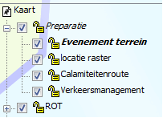
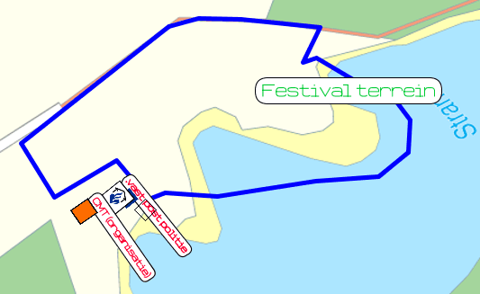
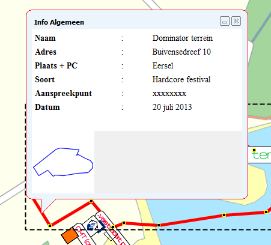
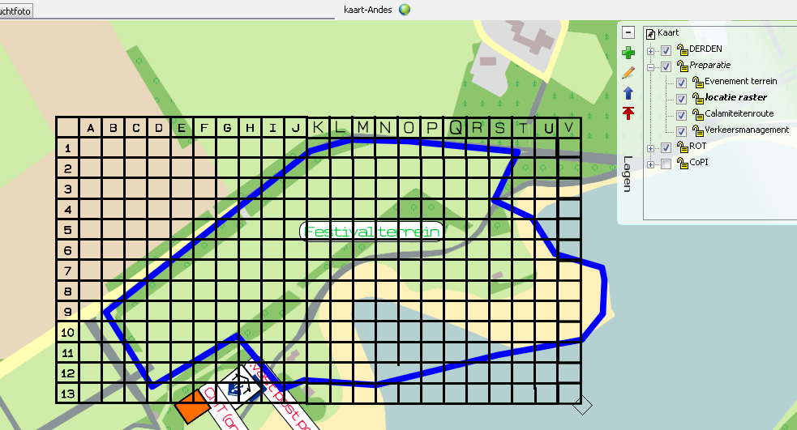
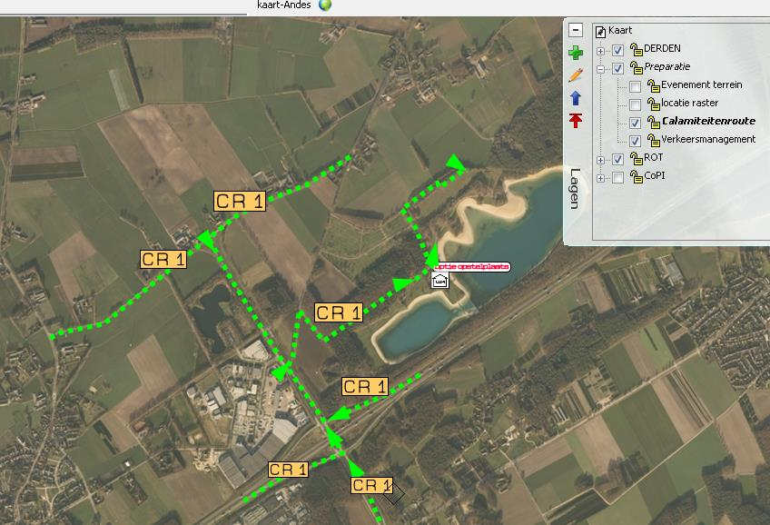
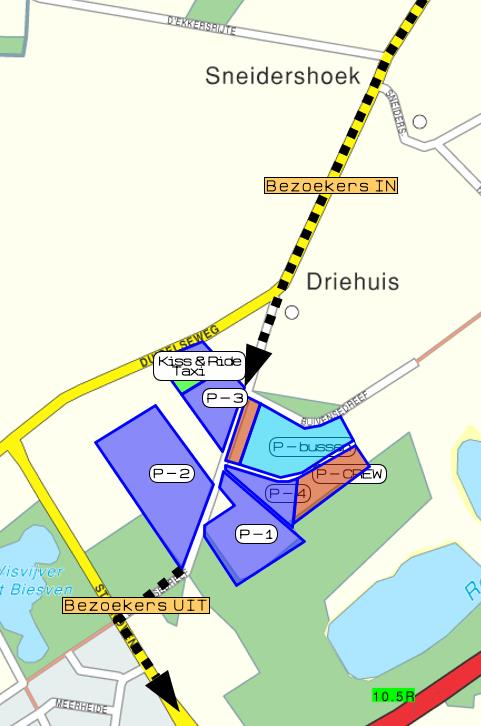

## 3.3 Preparatieve geografische informatie

### Preparatie informatie in LCMS

#### C- Evenementen[^8]
*Versie 0.1 14 november 2014*

Preparatie informatie kan op diverse wijzen in LCMS worden ingevoerd. In deze instructie wordt aangegeven op welke wijze dit dient te gebeuren in de voorbereiding bij C-evenementen, zodat dit voor de gebruiker op een eenduidige wijze wordt aangeboden.

De preparatie informatie wordt aangeleverd door of namens de vergunningverlener van het evenement.

De gebruiker van deze informatie is lid van de crisisorganisatie en gebruikt de informatie om zich voor te bereiden op een eventuele inzet of om tijdens een inzet de juiste beslissingen te kunnen nemen bij het coördineren van de bestrijding van het incident.

De behoefte om multidisciplinaire preparatie in breder verband te organiseren is de afgelopen jaren significant toegenomen. Te denken valt aan de noodzaak van een multidisciplinaire coherente aanpak in de voorbereidende fase op bijvoorbeeld:
- Risicovolle dagen, zoals de jaarwisseling of Koningsdag;
- Grote of potentieel risicovolle evenementen, Dance festivals, Marathons e.d.

Omdat LCMS verder in een incident het leidend systeem is binnen de Hoofdstructuur van de Rampenbestrijding dient het invoeren van, voor de incidentbestrijding benodigde preparatie informatie, éénduidig en transparant plaats te vinden.

In deze instructie zijn eisen opgenomen voor de LCMS plot omgeving.

#### Algemene uitgangspunten

##### Verantwoordelijke voor LCMS preparatie

De gemeente waar het evenement plaats vindt is als vergunningverlener verantwoordelijk voor het op de juiste wijze plaatsen van preparatie informatie in LCMS. De gemeente kan daarbij worden ondersteund door de kerninstructeurs LCMS van de eigen kolom en /of door het Team Multidisciplinaire Opschaling van de Veiligheidsregio.

##### Preparatie activiteit wordt repressie activiteit

Indien er bij een geprepareerd evenement een incident ontstaat die noopt tot een GRIP opschaling, dan wordt er geen nieuwe activiteit in LCMS aangemaakt maar wordt gebruik gemaakt van de geprepareerde LCMS-activiteit. De CaCo zal in dat geval de naam van de activiteit aanpassen zodat voor ieder duidelijk is dat het om een incident gaat.

##### Vaste naam in LCMS

Een preparatie van een C evenement is te herkennen aan de naamgeving van de activiteit:

[regionummer][EVENT][naam evenement] [gemeente]

Voorbeeld: 22 EVENT Dominator Eersel

Bij een opschaling in GRIP zal de CaCo deze naam wijzigen in:

[Regionummer - afkorting] [calamiteit] [ naam evenement] [gemeente]

Voorbeeld: 22-VRBZO[^9] instorting podium Dominator Eersel

##### Leiding en coördinatie
De informatie die via LCMS wordt gedeeld is bestemd om de leiding en coördinatie binnen de crisisstructuur te bedienen opdat de juiste besluiten kunnen worden genomen. Meer gegevens leiden niet per definitie tot een betere informatievoorziening. De preparatie informatie in LCMS zal daardoor heel sober zijn op een need-to-know basis. Aanvullende
informatie kan wel via de LCMS- Informatie-knop beschikbaar worden gesteld.

##### Preparatie versus de feitelijkheid
De informatie die in LCMS is ingebracht komt voort uit de plannen die in de preparatiefase zijn opgesteld. Bij een reëel incident is het daarom van belang om preparatie informatie te verwijderen indien deze niet meer strookt met de werkelijkheid om vervuiling van de beeldvorming te voorkomen.

#### Preparatie in LCMS plot

##### Kaartlagen keuze 
Om de Evenement- preparatiegegevens op effectieve wijze in het plot te plaatsen bestaat het plot uit meerdere kaartlagen, oleaten genoemd, die naar behoefte aan of uitgezet kunnen worden.

De preparatie oleaat wordt aangebracht boven de functielagen. De  preparatie oleaat kent een aantal sub lagen. De standaard sub lagen zijn:

- Evenement terrein
- Locatie raster
- Calamiteiten route
- Verkeermanagement

Zie voorbeeld.

Het aantal sub lagen kan worden uitgebreid of aangepast naar behoefte van de preparatie
van dat incident. Meer kaartlagen maakt het beeld niet altijd duidelijker. In de keuze moet
uitgegaan worden van de meerwaarde van de beelden voor leiding en coördinatie van een
mogelijk incident dat zodanige vorm aanneemt dat de geplande coördinatie vorm
ontoereikend is of dat deze de organisatie van het incident in handelingsverlegenheid
brengt.

#### Preparatie oleaat
In de preparatie oleaat worden alleen vaste locaties aangegeven die in het draaiboek genoemd zijn.

##### Evenement terrein -laag
In deze laag worden de contouren van het evenementterrein weergegeven. In de [attributen]wordt de naam van het evenement, het adres van de locatie en de contactpersoon aangegeven. Deze gegevens zijn gelijk aan die in het tabblad MK van LCMS-tekst.

- Contouren evenemententerrein zijn blauw (0,3 lijndikte, ononderbroken lijn)
- Er wordt geen vulling aangebracht om het zicht via het raster niet te verstoren.

Ook wordt in deze laag de vaste post van het Calamiteiten Managementteam (of organisatie) aangegeven en eventuele andere vaste posten die relevant zijn voor de hulpverlening bij een opschaling.

Alle symbolen in deze lagen hebben een afmeting tussen 50 en 125 m. Bij het plaatsen van de symbolen wordt ingezoomd tot een schaal van 150 m. De symbolen dienen mee te schalen met de tekening.

De symbolen worden via [tekst aanpassen] voorzien van een label met de functie van het symbool. Zie onderstaand voorbeeld.

##### Locatie raster – laag
Bij veel grote evenementen wordt er door de organisatie op de kaart van het terrein een
raster geplaatst met coördinaat aanduidingen. Dit raster maakt het de organisatie en eventuele hulpverleners gemakkelijk om de juiste locatie van een incident te duiden.

Een zelfde raster kan LCMS worden opgenomen. Het raster wordt in een aparte kaartlaag geplaatst zodat deze uitgezet kan worden om de onderliggende informatie zichtbaar te maken. Zie onderstaand voorbeeld.

##### Calamiteiten route - laag
In de calamiteiten route laag wordt de route aangegeven die hulpverleners het beste kunnen volgen om bij het evenemententerrein te komen.

De te volgen route wordt met een groene gestippelde lijn aangegeven. De route wordt
voorzien van pijlen. Indien er ter plaatse bebording deze route markeert, wordt deze aanduiding ook op de kaartlaag aangegeven. Bij de attributen van de pijlen wordt de tekst ‘Calamiteitenroute’ vermeld. In deze laag wordt ook de voorgestelde opstelplaats van het CoPI opgenomen. Zie onderstaand voorbeeld.

##### Verkeersmanagement -laag
In de verkeersmanagement laag worden verkeersroutes en parkeerterreinen opgenomen die de bezoekers volgen van en naar het evenemententerrein.

Parkeerterreinen worden voorzien van een blauwe contourlijn van 0,3 mm en een afwijkende kleur opvulling niet zijnde rood of oranje. De nummering/ naam van het terrein komt overeen met het draaiboek, maar dient wel uniek te zijn.

De verkeersroute wordt aangegeven met een zwarte stippellijn 1 mm, eventueel voorzien van pijlen die de aan- of afvoer route markeert. Bij de lijn wordt met tekst aangegeven welke route het betreft. Zie voorbeeld.

### Advies en ondersteuning
Voor advies en ondersteuning bij het samenstellen van preparatie informatie in LCMS kunt u terecht bij XXXXX (in te vullen door de regio).

[^8]: Classificatie volgens de Handreiking Evenementen Veiligheid.
[^9]: In de regio Brabant-Zuidoost is het gebruikelijk om multidisciplinaire incidenten aan te duiden met de afkorting van de naam van de Veiligheidsregio om zo onderscheidt te maken met bijv. een mono opschaling van de brandweer (22-BRW uitslaande brand zorgcentrum De Eelde, Deurne).
