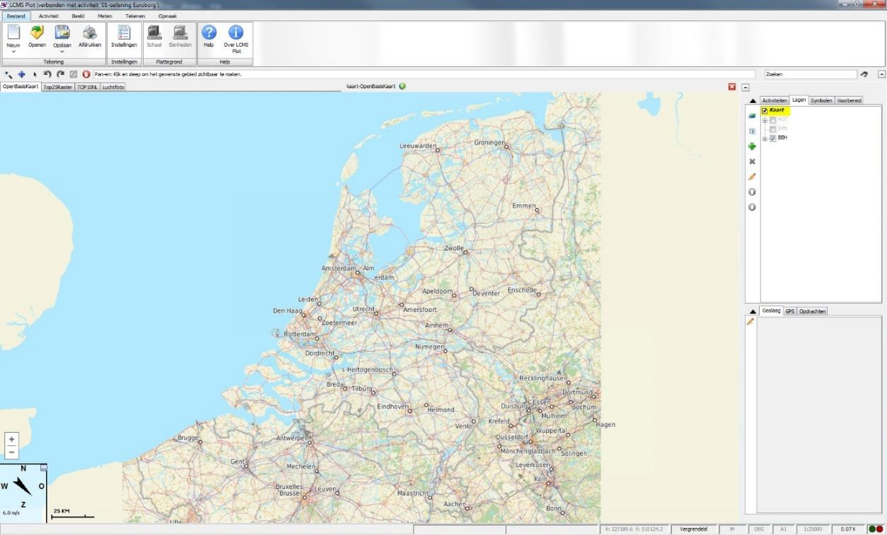
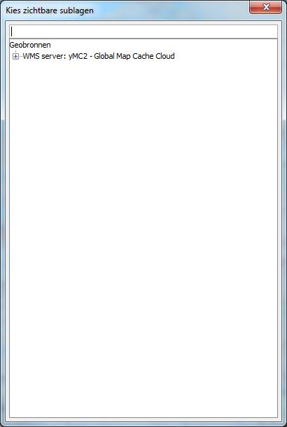
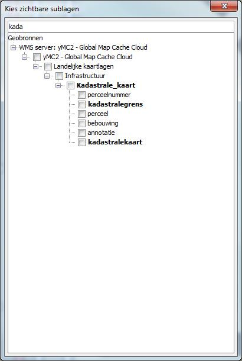
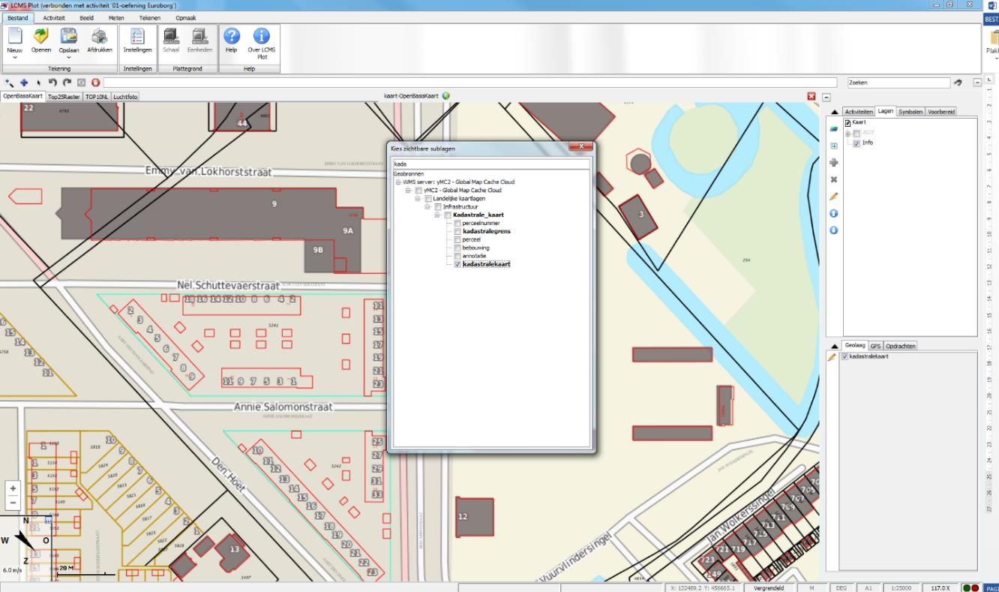
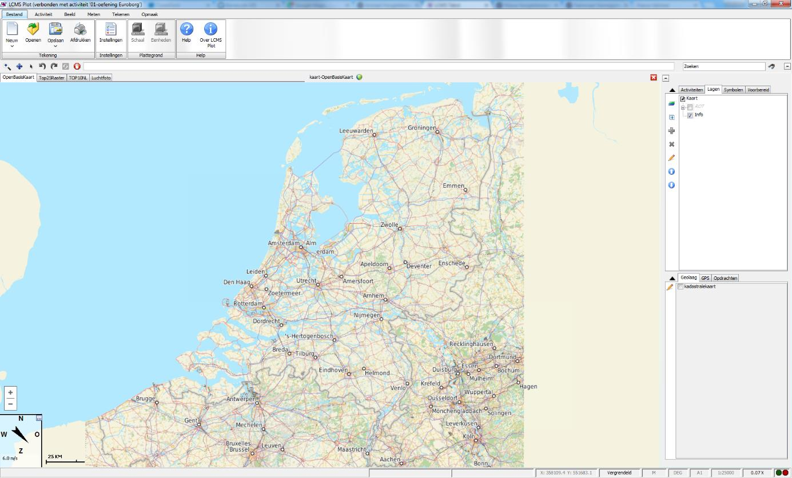
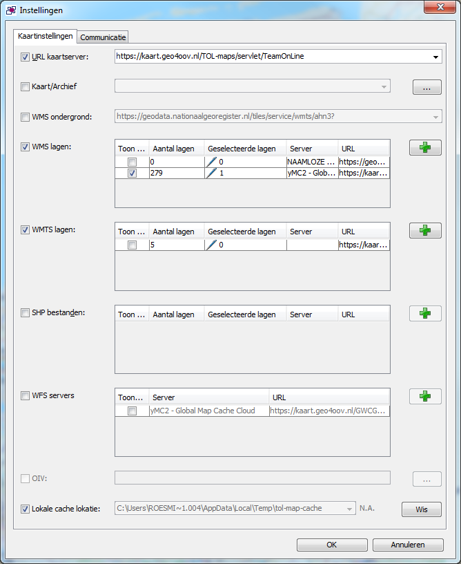
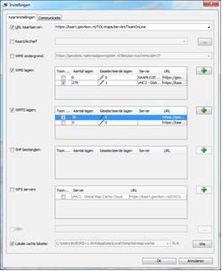
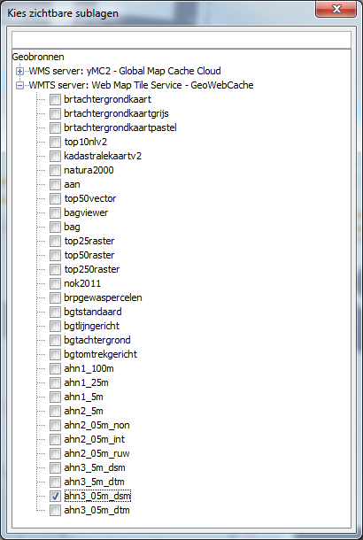
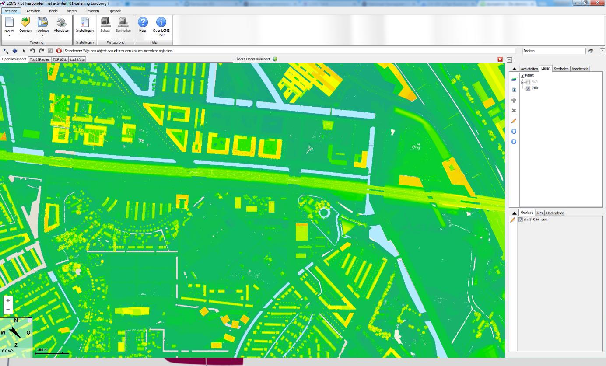

## 3.4 Verschillende soorten kaartlagen

Binnen LCMS-Plot kunnen diverse soorten type kaarten worden gebruikt voor het visualiseren van de plot. De informatie die beschikbaar komt in LCMS en via de landelijke geoserver is zeer dynamisch. Voor een volledig overzicht wordt verwezen naar de website van de _"Geo4OOV geoserver"_ [http://www.geo4oov.nl](http://www.geo4oov.nl), _"Publieke dienstverlening op de kaart"_ [(pdok)](https://www.pdok.nl/), of rechtstreeks bij de bron (waar het kan of mag). Het is ook mogelijk om handmatig bestanden op te laden, zie hiervoor de handleiding LCMS Plot, [geavanceerd: Kaartlagen](../../handleiding/geavanceerd_kaartlagen.md).

Hieronder is een korte handleiding voor het importeren van de beschikbare kaartlagen uit geo4oov.nl en de kaartlagen van externe partijen. 

### Importeren van de standaard beschikbare WMS lagen

Klik op het ‘potloodje’.

De gewenste laag verschijnt in de tab ‘Geolaag’.

typ (het begin van) de gezochte laag.

Bijvoorbeeld de kadastrale kaart. Vink vervolgens de gewenste kaartlaag aan.

De gewenste laag verschijnt in de tab ‘Geolaag’.

### Een WM(T)S laag van een externe partij importeren

Klik op het ‘Instellingen’.

Klik op het plusje om de URL van de WMTS laag toe te voegen. Voeg de URL toe, bijvoorbeeld die van de [AHN](https://geodata.nationaalgeoregister.nl/tiles/service/wmts/ahn3?)

Vink de net toegevoegde WMTS laag aan.

Klik nu weer op het potloodje om dit scherm op te roepen.
De net toegevoegde WMS server heeft 30 lagen. Vink de
gewenste laag aan, bijvoorbeeld de ‘Hoogte Kaart’.

De kaartlaag kan met het vinkje in de tab ‘Geolaag’ worden aan- en uitgezet.

