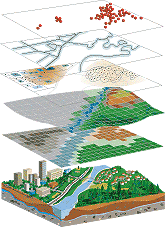
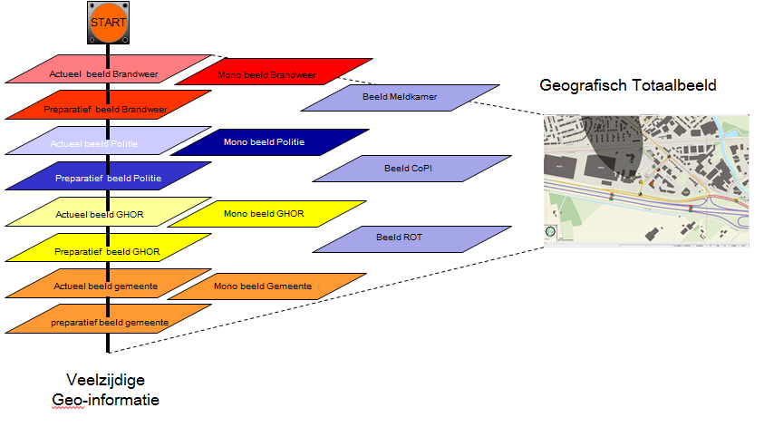
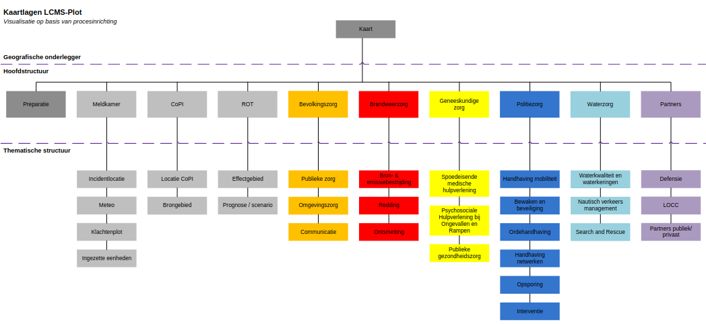

# 1. Visie en doel van geo-informatie

## 1.1 Geografie

De meeste aspecten van een ramp of crisis hebben een
geografische component: waar is de ramp of crisis, waar
bevinden zich de hulpdiensten, waar merken we effecten als de dijk
doorbreekt? Een belangrijk deel van de informatie tijdens een
ramp of crisis is geografische informatie. __Geografische
informatievoorziening__ helpt de crisisorganisatie bij de
beeldvorming en ondersteunt hiermee de coördinatie tijdens een
ramp.

De kracht van geografie is dat het een weergave van de
werkelijke wereld visualiseert in beeld dat bestaat uit
verschillende (kaart)lagen. Deze lagen kunnen zowel algemene
als incident specifieke geografische informatie bevatten. Het
inzichtelijk maken van deze statische en dynamische ruimtelijke
informatie draagt bij aan het coördineren van het multidisciplinaire
netwerk van de crisisbeheersing. Geografische informatie is
daarmee uiterst geschikt ter ondersteuning van het proces leiding
en coördinatie.



```
Figuur 1. Geografische informatie

Voor het gebruik hiervan is een 
specifieke tool nodig: een 
Geografisch Informatie Systeem,
GIS. Het geheel van de data, 
dataopslag en de functionaliteit 
van een GIS vormt een 
Geografische 
Informatievoorziening.
```

## 1.2 Principes geografische informatie en netcentrisch werken

Het spreekwoord “één plaatje zegt meer dan 1000 woorden” geeft aan waarom naast een
tekstbeeld ook een __geografisch beeld__ gewenst is tijdens een incident. Deze behoefte
ontstaat omdat men graag een totaalbeeld wil vormen van een incident. Het totaalbeeld
bestaat uit een tekstueel beeld en een geografisch beeld.

Het proces informatiemanagement heeft als doel om een actuele overdraagbare
representatie van een grootschalig incident te geven, ter ondersteuning van het proces
leiding en coördinatie binnen de hoofdstructuur van crisisbeheersing en rampenbestrijding.
Een geografisch beeld maakt integraal onderdeel uit van deze actuele overdraagbare
representatie.

Het vormen van dit multidisciplinair geografisch beeld wordt gedaan aan de hand van de
monodisciplinaire geografische eigen beelden die opgebouwd zijn uit actuele informatie met
een geografische component en het preparatief geografisch beeld. Zie ook Figuur 2.



```
Figuur 2.

Opbouw multidisciplinair 
geografisch totaalbeeld, 
gebaseerd op het 
geografisch beeld dat door
elk monodisciplinair team
opgebouwd wordt.
```

## 1.3 Leiding en coördinatie

Het proces informatiemanagement is ondersteunend aan het proces leiding en coördinatie.
Binnen het proces informatiemanagement is het bijhouden van het geografisch beeld belegd
bij geografisch informatiemedewerker of bij de informatiemanager. Bij aanwezigheid van een
geografisch informatiemedewerker maakt deze onderdeel uit van de sectie
informatiemanagement en legt in dat geval verantwoording af aan de informatiemanager. De
informatiemanager is eindverantwoordelijk voor zowel het multidisciplinaire tekstuele en
geografische beeld.

Het proces leiding en coördinatie maakt veelal gebruik van een structuur die bestaat uit
Beeld- Oordeels- en Besluitvorming. Geografische informatie kan op al deze drie onderdelen
ondersteuning bieden.

### Beeldvorming

Bij beeldvorming kan door een geografisch beeld de feitelijke situatie worden getoond.
Welke geografische componenten worden weergegeven kan door de gebruiker zelf worden
bepaald door kaartlagen al dan niet te selecteren. Vragen zoals, waar is het incident, waar
staat het CoPI en welke gebieden worden bedreigt, kunnen met behulp van dit beeld
gemakkelijk worden beantwoord.

### Oordeelsvorming
Bij oordeelsvorming wordt er gekeken naar de __knelpunten__ waar de crisisorganisatie
vervolgens mee te maken heeft. Ook dit onderdeel kent geografische aspecten, zoals welke
vitale voorzieningen – gezien de geografie – worden bedreigd. Om geografische antwoorden
te kunnen geven op knelpunten zal er in sommige gevallen een analyse gemaakt moeten
worden. Bij een knelpunt, hoe gaan we de bevolking waarschuwen, kan de geo-informatie

medewerker de WAS palen zichtbaar maken in het effectgebied. Een knelpunt kan ook in de
toekomst liggen waarbij het noodzakelijk is om een __prognose__ op te stellen. Deze prognose kan ook geografische aspecten kennen en ruimtelijk worden weergegeven. Bij een emissie van een gevaarlijke stof kan een eerste indicatie van het effectgebied worden weergegeven met een vlak, de zogenaamde Gasmal.

Bij een verwachte draaiing van de wind kun je weergeven wat het verwachte effectgebied
gaat worden door deze mal te plaatsen met een tijdstip wanneer verwacht wordt dat het
effectgebied zich verplaatst.

### Besluitvorming

De besluiten die worden genomen, en de hieruit voortvloeiende acties, kunnen vaak deels
geografisch worden vertaald. Het besluit om een loodspost te gebruiken kan bijvoorbeeld in
het geografische beeld worden opgenomen.

## 1.4 Geografische Informatievoorziening

Voor het werken met geografische informatie en het kunnen ontsluiten van __preparatieve
gegevens__ is geografische informatievoorziening noodzakelijk. Een onderdeel daarvan is de
beschikbaarheid van de geo-informatie. Hiervoor is een start gemaakt met het zogenaamde
landelijke geoserver van Geo4OOV. Hiermee beschikt de crisisorganisatie over diverse
geografische informatie uit onder andere basisregistraties van Ministeries en veel van
onze crisispartners[^2]. Zo kan de kaartlaag met kwetsbare objecten uit de professionele
risicokaart worden getoond.

Een belangrijk uitgangspunt dat met deze voorziening wordt gerealiseerd is het principe:
**“data bij de bron”**. Dit betekent: je kunt de kaartlaag ontsluiten wanneer dat nodig is, maar
het beheer van de inhoud en het onderhoud van de data wordt door de eigenaar uitgevoerd.
Deze methodiek zorgt er voor dat je op één plek de informatie beheert en deze op meerdere
plaatsen te gebruiken is.

Bij het inrichten van een geografische informatievoorziening is van groot belang dat de
relevante standaarden[^3] worden toegepast. Eén daarvan is het gebruik van de standaarden
voor het gebruik van de geo-informatie door de gebruikers en in verschillende GIS-
systemen.


## 1.5 Visualisatie

Voor de visualisatie van het geografisch en het tekstbeeld is een referentiedocument
opgesteld **‘Crisismanagementsysteem Visualisatie Principes 2014-01-20’**[^4]. Hierin staan
uitgangpunten benoemd voor zowel geo als tekst visualisatie. Dit referentiedocument geeft
de werkgroep plot handvatten bij de verdere doorontwikkeling van geografische
informatievoorziening.


[^2]: Voor een volledig overzicht wordt verwezen naar: [http://www.geo4oov.nl/geo-catalogus/landelijke-kaartsets](http://www.geo4oov.nl/geo-catalogus/landelijke-kaartsets)

[^3]: Open Geospatial Consortium, VERA 2.0

[^4]: [https://www.dropbox.com/s/1bfahnao51r61wg/Crisismanagementsysteem%20visualisatie%20Principes%20Werkwijze%en%20Visie%202014-01-20.docx?dl=0](https://www.dropbox.com/s/1bfahnao51r61wg/Crisismanagementsysteem%20visualisatie%20Principes%20Werkwijze%en%20Visie%202014-01-20.docx?dl=0)

## 1.6 Eisen aan het geografisch beeld

In het Besluit Veiligheidsregio’s (versie 2023: artikel 10, 46-48) wordt gesproken over de minimale inhoud van een totaalbeeld en daarmee indirect ook van een geografisch beeld. Een
geografisch beeld moet voldoen aan de elementen die in het besluit en de wet zijn vastgelegd. De bereikbaarheid van een rampterrein door de hulpverleners kan bijvoorbeeld
worden weergegeven in het geografische totaalbeeld. Het geografisch beeld moet daarnaast
overeenstemmen met de tekstuele informatie. Dat betekent niet dat informatie waar mogelijk
zowel geografisch als tekstueel dient te worden weergegeven maar dat de beide delen van
het beeld elkaar dienen aan te vullen.

## 1.7 Plot organisatie

De visie van het netcentrisch werken is dat de bronhouder van de informatie oftewel de
producthouder van zijn monodisciplinair geografisch eigen beeld, die dit zelf deelt middels
een daarvoor bestemd crisismanagementsysteem.

Hierbij kan de opmerking gemaakt worden dat de Veiligheidsregio hier haar eigen invulling
aan mag geven zolang men maar de **minimale inhoud** op het multidisciplinaire geografisch
beeld toont. Dit geldt mede voor de functionaris die belast is met het verzorgen van dit
geografisch beeld.

In de [**stamkaart plot**](./3._Operationele_bijlagen/3_8_stamkaart_plot.md) is aangegeven worden welke informatie thuishoort op welke kaartlaag
(zie bijlage 3.9). Hiermee wordt een uniforme werkwijze bewerkstelligd in de
werkzaamheden van de geo-informatie medewerker t.b.v. rampenbestrijding en
crisisbeheersing.


#### Figuur 3. Thematische kaartlagen voor het geografisch beeld




