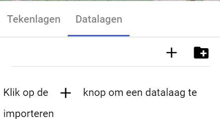
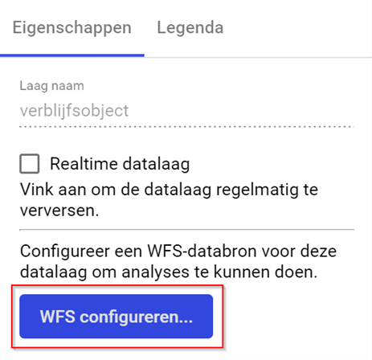
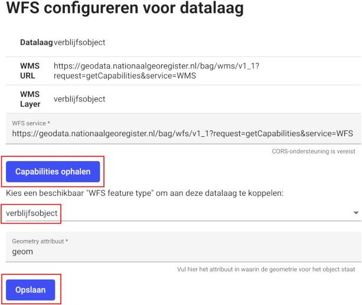
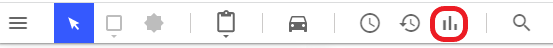
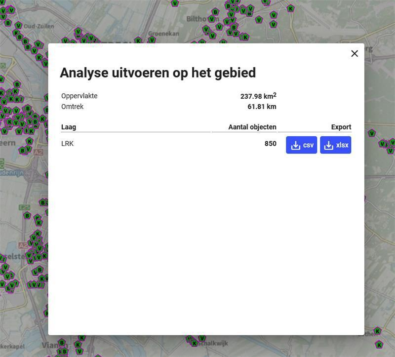

# 8  Geavanceerd: Analyses 

 
Met de analysefunctie kun je een analyse uitvoeren op een specifiek gebied op basis van 
toegevoegde datalagen. Denk bijvoorbeeld aan het ophalen van het aantal verblijfsobjecten 
of kwetsbare objecten in een bepaalde woonwijk.  
Het is mogelijk om analyses uit te voeren op een eigen WFS datalagen en op de standaard 
Geo4OOV WFS datalagen. Een WFS datalaag wordt in zowel XML-structuur als html-  
structuur geaccepteerd. 
 
Om een analyse uit te voeren op objecten in de kaartlaag moet een WMS datalaag 
geconfigureerd zijn met een WFS data. 

## 8.1  Stap 1: datalaag configureren 

Voordat je een gebied kan analyseren moet je een 
datalaag hebben toegevoegd en geconfigureerd. 
Het toevoegen van datalagen kun je vinden in het 
hoofdstuk Aanmaken datalagen en gaat via plus 
knop: 
 
Nadat je de datalaag hebt toegevoegd selecteer je 
deze datalaag in het linker venster. Vervolgens zie 
je in het rechter venster de mogelijkheid om de 
WFS te configureren. Dit is nodig om een analyse 
uit te kunnen voeren. Klik op WFS configureren. 
 
Je klikt op WFS configureren en vervolgens op 
_Capabilities_ ophalen. Hierna wordt een drop-down 
met de "feature types" (vergelijkbaar met WMS 
datalagen) getoond. Kies het feature type dat 
overeenkomt met de datalaag. Als er een feature 
type is met exact dezelfde naam als de laag, wordt 
deze automatisch geselecteerd. 
 
Afhankelijk van de WFS is het nodig het 
correcte "Geometry attribuut" in te vullen. 
Probeer eerst of de standaardwaarde 
"geom" werkt. 

  
  

## 8.2  Stap 2: Analyse uitvoeren 

Om de analyse uit te voeren klik je in het boven menu op de knop analyse (de staafdiagram). 
 
Selecteer het gebied waar je de analyse wilt uitvoeren, dubbel klik om het gebied te bepalen waarmee het gebied wordt aangegeven. De gegevens binnen dit gebied worden getoond (zie hieronder). De gebruiker kan vervolgens kiezen om de data van een van de lagen te exporteren naar een csv- of Excel-bestand. 
 
Na het kiezen van een van de download optie “csv of xlsx” kan het resultaat worden geopend in Excel-bestand. 
