# 10. Geavanceerd: Import en export van kaartlagen 

In het rechter paneel ziet de gebruiker op het tabblad eigenschappen onderaan twee knoppen voor het importeren en exporteren van tekenlagen of van objecten. 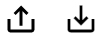

1. Objecten importeren (linker knop) 
  a. Uit een bestand  
  b. WFS als tekenlaag 
2. Exporteren naar GeoJSON (rechter knop) 
 
## 10.1 Importeren uit een bestand

### 10.1.1 Importeren

Objecten kunnen in een bestaande tekenlaag worden geïmporteerd. Vanuit de eigenschappen venster wordt de import-knop gekozen. Daar volgt een pop-up scherm waar het bestand gekozen kan worden.

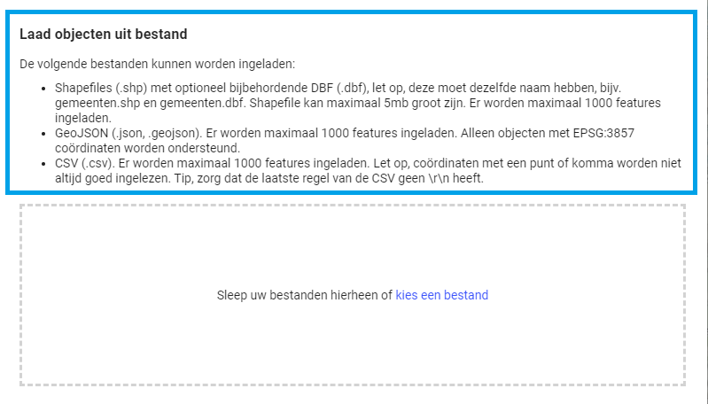

Na het laden wordt het bestand in een lijst weergegeven.
Het bestand kan daar weer gewist worden. Ook is het mogelijk nog andere bestanden te laden. Deze worden alle in de tekenlaag opgenomen na het klikken op de Laad objecten-knop.

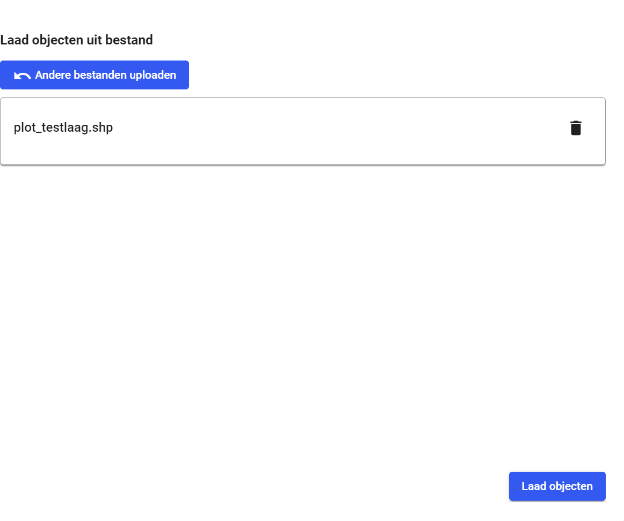
 
De objecten zitten nu in de kaartlaag en worden op de kaart getoond. Deze objecten kunnen op dezelfde manier bewerkt worden als zelf getekende objecten. 

### 10.1.2 Objecten importeren uit een bestand met filter

Als er objectinformatie wordt meegeleverd met de kaartlaag dan wordt het formulier uitgebreid met twee functies:

1. Attribuut dat gebruikt moet worden voor label bij object. 
2. Attribuut waarop gefilterd wordt bij import.

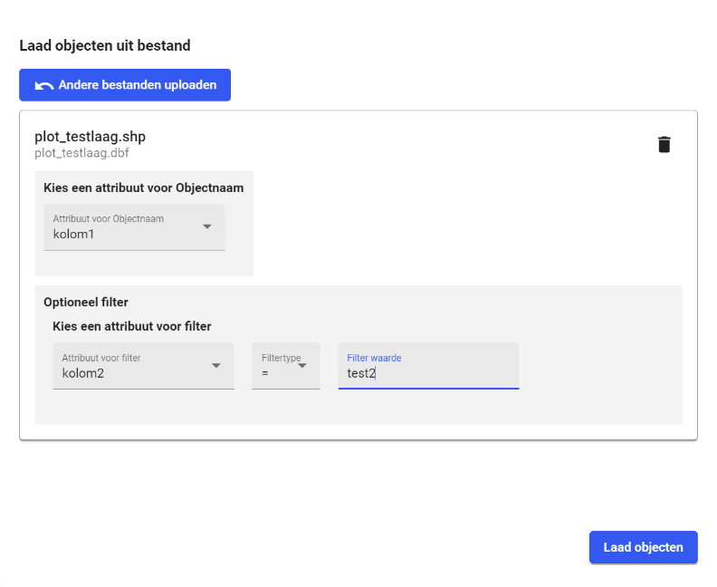  
 
Het filter zorgt ervoor dat alleen objecten worden geladen die een attribuutwaarde hebben overeenkomstig het filter. Het filter 
kan ook leeg gelaten worden; alle objecten tot een maximum van 
100 worden geladen op de kaart. 
 
### 10.1.3 Default symbool, kleur en label aangeven bij importeren

Een kleur en label kunnen worden meegeven bij het importeren van een object uit een Shape bestand. De bestanden die geïmporteerd kunnen worden zijn: CSV, Geojson en Shapefile. Een kanttekening is dat het juiste formaat van de bestanden gebruikt moeten worden, anders zal het niet werken.

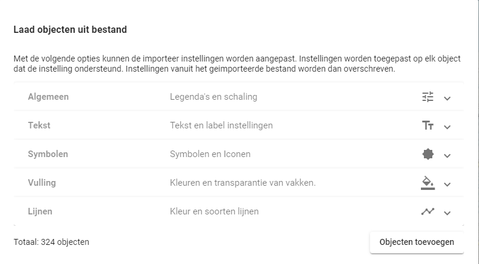  
  
## 10.2 Import WFS als tekenlaag 
Een WFS-datalaag kan worden geïmporteerd als een tekenlaag zodat deze aangepast kan 
worden zonder te synchroniseren met de datalaag. 

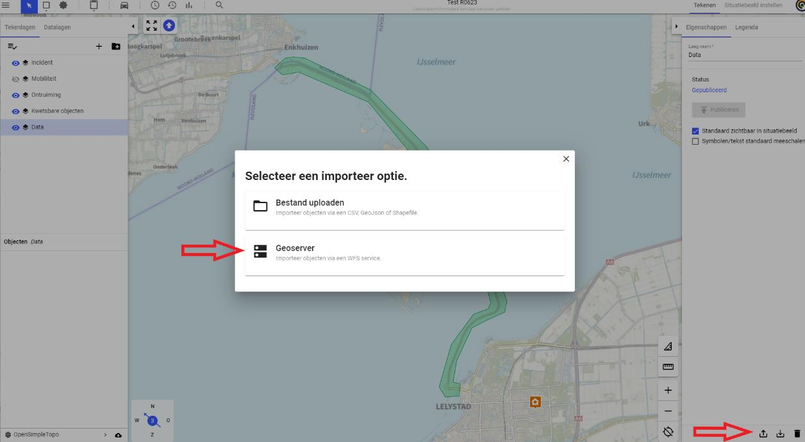   
 
Klik rechtsonder op het icoon “Objecten importeren” en selecteer “Geoserver”.  

Vul de URL van de WFS-server in en klik op ‘Capabilities ophalen’. 

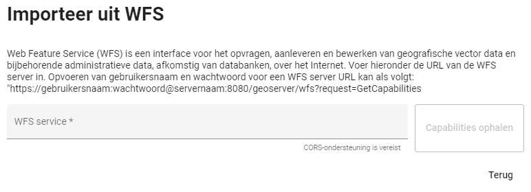
 
Als de server eigenschappen (capabilities) zijn opgehaald, worden de beschikbare lagen 
getoond. 

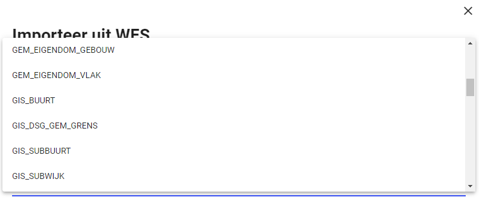  

Het is mogelijk om de objecten op te maken; o.a. symbool, vulling of lijnkleur.

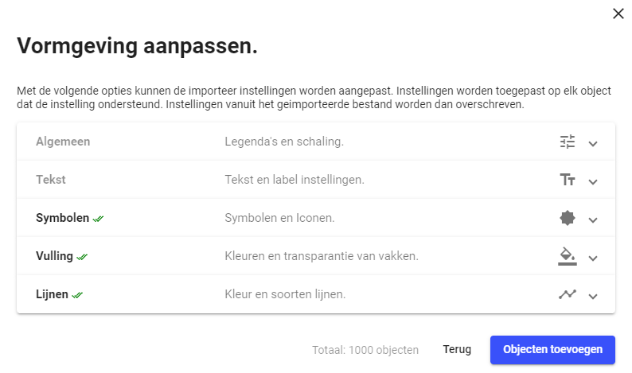  
 
 
Na het laden en “Objecten toevoegen” wordt de WFS-laag als tekenlaag toegevoegd: 
 
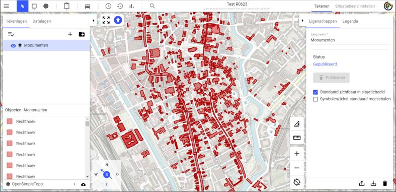

## 10.3 Exporteren tekenlaag naar GeoJSON 

### 10.3.1 Exporteren alle objecten tekenlaag

Het exporteren van alle objecten van een tekenlaag, voor gebruik van een andere applicatie dan LCMS kan alleen via GeoJSON. Via de import-functie kunnen deze objecten ook weer geladen worden. Let op dat GeoJSON WGS84 coördinaten gebruikt.

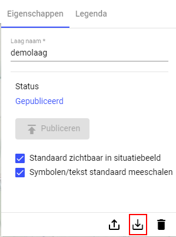

### 10.3.2 Eén object exporteren naar GeoJSON

Naast hierboven genoemde exporteren van een gehele tekenlaag, is het mogelijk om enkele objecten te exporteren. Dit kan gedaan worden door op één object te klikken en dan op de export knop te klikken onderaan.