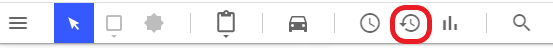
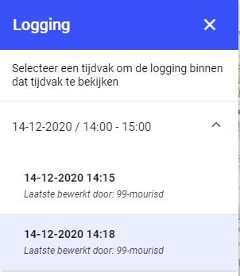

# 7  Geavanceerd: Logging 

  
  
  

In Plot is het mogelijk om de historie van een tekening te bekijken. Hierdoor kun je de 
ontwikkeling van een tekening in verloop van de tijd terughalen. Om naar de logging 
functionaliteit te openen, klik je in het bovenste balk in het menu op het klokje met een pijltje 
eromheen. 
 
Het logging venster wordt geopend, hier zie je de tijdvakken die je kunt bekijken. 
 
Vervolgens zie je in het logging venster onder het geselecteerde tijdvak de veranderingen 
die zijn gedaan. Door een van de data en tijden te selecteren, kan je zien hoe de tekening 
zich heeft ontwikkeld. 
 
Om het logging venster te sluiten klik je op het kruisje rechtsboven in. 
