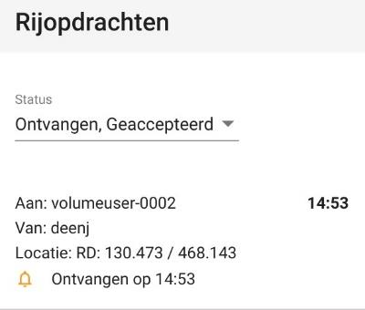

# 9. Geavanceerd: meet- en rijopdrachten

Bij meet- en rijopdrachten is het mogelijk om voertuigen en gebruikers op de kaart te zien 
bewegen en van opdrachten te voorzien. De knop voor meet- en rijopdrachten is **alleen** 
**beschikbaar** voor de huidige profielen met de rollen:

- “plot opdracht verstrekker”  
- en “plot opdracht ontvanger”. 
 
In dit hoofdstuk worden de volgende onderdelen uitgelegd; het versturen van rijopdrachten, 
ontvangen van rijopdrachten, versturen van meetopdrachten en ontvangen van 
meetopdrachten. 

  
 
Wanneer de gebruiker op de knop meet- en rijopdrachten klikt verschijnt het volgende 
scherm:

  

De gebruiker kiest een van deze tabbladen: rijvoertuigen of meetvoertuigen. Het rechter 
paneel past zich aan de gekozen functie links. 
 
 
_Voorbeeld menuweergave van een gebruiker met de rol “plot opdracht verstrekker” of “plot 
opdracht ontvanger”:_ 

  
 
_Voorbeeld menuweergave van een gebruiker met een van de overige rollen:_ 

 

## 9.1  Rijopdracht versturen 

De rollen “plot opdracht verstrekker” en “plot opdracht ontvanger” gaan rechtstreeks naar de 
rij- en meetopdrachten module om een opdracht aan te maken of aan te nemen. 

  
 
### 9.1.1 Lijst en status van rijopdrachten

In het linker paneel wordt het tabblad Rijvoertuigen gekozen. Hier kan een gebruiker met het 
recht flankcommandant de beschikbare voertuigen zien. In het rechter paneel staan alle 
beschikbare rijopdrachten. Een gebruiker met het recht flankcommandant kan hier ook een 
nieuwe rijopdracht worden aangemaakt.

  

Een rijopdracht gaat door een aantal statussen: 

 

- verzonden (flankcommandant)  
- ontvangen (automatisch na ontvangst) 
- geaccepteerd (bevelvoerder: plotrecht basis)  
- afgerond (bevelvoerder: plotrecht basis)  
- gesloten (flankcommandant) 
- ingetrokken (flankcommandant) 

De lijst met opdrachten kan op basis van die statussen 
gefilterd worden. 

 

### 9.1.2 Details van een verstuurde rijopdracht

Klikken op een rijopdracht geeft de details van de rijopdracht. 
Ook kan hier de rijopdracht geannuleerd worden. Het rechter 
paneel er dan als volgt uit. Achtereenvolgens worden getoond: 
ontvanger, verzender, status, tijd dat de opdracht door de 
server ontvangen is en de coördinaten. Ook kan de rijopdracht 
geopend worden in Google Maps. Op de mobiel kan ook 
gekozen voor een andere navigatie applicatie. 

  
 
### 9.1.3 Aanmaken van een rijopdracht

Een nieuwe rijopdracht wordt gemaakt door het klikken op de 
knop boven in de lijst met rijopdrachten "+ Rijopdracht maken". 
In het rechter paneel opent een nieuw scherm. De gebruiker 
met flankcommandant rechten dient vervolgens in het linker 
paneel het gewenste voertuig te selecteren en in de kaart een 
locatie te kiezen (klikken). Na klikken op versturen wordt de 
rijopdracht verzonden naar de gebruiker. 
 
  
 
 
## 9.2  Rijopdracht ontvangen 
### 9.2.1 Lijst en status van rijopdrachten

In het linker paneel wordt het tabblad Rijvoertuigen 
gekozen. In dit paneel staan de beschikbare voertuigen 
waarvoor een rijopdracht gedefinieerd kan worden. Daarna 
kan de gebruiker met de rol ‘Plot opdrachten ontvanger’ zijn 
ontvangen rijopdrachten zien in het rechtertabblad. 

 

De gebruiker met de rol ‘Plot opdrachten ontvanger’ 
ontvangt de opdracht van de gebruiker met de rol ‘Plot 
opdrachten verstrekker’ en kan de opdracht accepteren en 
kan na uitvoering de opdracht afronden. 
 
   
 
### 9.2.2 Details van een ontvangen ontvangen rijopdracht

Klikken op een rijopdracht geeft de details van de rijopdracht. Afhankelijk van de status van 
de opdracht kan de bevelvoerder hier de opdracht accepteren of afronden. 
Achtereenvolgens ziet het rechter paneel er als volgt uit. 
Afbeeldingen van links naar rechts: een ontvangen rijopdracht, een geaccepteerde 
rijopdracht en een afgeronde rijopdracht. 

  
  
  

## 9.3  Meetopdracht versturen 
### 9.3.1 Lijst en status van meetopdrachten

In het linker paneel wordt het tabblad 
meetvoertuigen gekozen. 

  

Hier kan de 
meetplanleider de beschikbare voertuigen zien. 
In het rechter paneel staan alle beschikbare 
meetopdrachten. Als meetplanleider kan hier ook 
een nieuwe meetopdracht worden aangemaakt. 
 

  
### 9.3.2 Details van een meetopdracht

Klikken op een meetopdracht geeft de details van de 
meetopdracht weer. 

 

Ook kan hier de meetopdracht 
geannuleerd worden. Het rechter paneel er dan als volgt uit: → 

  

Vervolgens kan de meetplanleider in een pop-up de 
meetresultaten inzien, in het geval deze al beschikbaar zijn. 
 
### 9.3.3 Aanmaken van een meetopdracht
Een nieuwe meetopdracht wordt gemaakt door het klikken 
op de knop boven in de lijst met meetopdrachten "+ 
Meetopdracht maken". In het rechter paneel opent een 
nieuw scherm. → 

  
De meetplanleider dient vervolgens in het linker paneel het 
gewenste voertuig te selecteren en in de kaart een locatie te 
kiezen (klikken). In het rechtervoorbeeld is de locatie en de 
gewenste voertuigen al geselecteerd. 

 
Tot slot dient de meetplanleider de gewenste metingen te 
definiëren via de knop meetopdracht maken. 
 
  

Na het aanmaken van een nieuwe meetopdracht wordt het nummer (en eventueel extra 
tekst) weergegeven bij gasmeetbuisje.  
 
  
 
Na het verstrekken van deze details keert de gebruiker terug naar het vorige scherm en kan 
de opdracht verzonden worden. 

 
## 9.4  Meetopdracht ontvangen

### 9.4.1 Lijst en status van meetopdrachten

In het linker paneel wordt het tabblad meetvoertuigen gekozen. 

 
 
 
 
In dit paneel staan de beschikbare voertuigen waarvoor een meetopdracht gedefinieerd kan 
worden. Daarna kan de bevelvoerder zijn ontvangen meetopdrachten zien in het 
rechtertabblad. 
 
 
**45/52** 
 

* * *

  
  
  
 
 
Een meetopdracht gaat door een aantal statussen: 
• 
verzonden (meetplanleider)  
• 
ontvangen (automatisch na ontvangst)  
• 
geaccepteerd (bevelvoerder)  
• 
afgerond (bevelvoerder) 
• 
gesloten (meetplanleider)  
• 
ingetrokken (meetplanleider) 
 
De bevelvoerder ontvangt de opdracht van de 
meetplanleider en kan de opdracht accepteren en kan 
na uitvoering afronden. 
 
De lijst met opdrachten kan op basis van die statussen gefilterd worden. 
 
 
 
**46/52** 
 

* * *

  
  
  
  
**9.4.2 Details van een meetopdracht** Bij het klikken op een meetopdracht worden de details van de 
meetopdracht weergegeven. Afhankelijk van de status van de 
opdracht is het mogelijk voor de bevelvoerder de opdracht te 
accepteren of te afronden. Het rechter paneel ziet er als volgt 
uit: → 
 
 
 
 
 
 
 
 
 
 
Nadat de bevelvoerder de meetopdracht 
geaccepteerd verschijnt er nu de knop 
Meetresultaten invullen. Bij selectie van deze 
verschijnt er een dialoogvenster, waarin alle 
meetgegevens ingevuld kunnen worden. Als de 
meetresultaten goed zijn kan men die opslaan met 
de knop rechts onderin. Na het opslaan van 
meetresultaten kan op de knop onderin op de 
opdracht afgerond en verstuurd worden. 
 
 
 
 
 
 
 
9.5  Locatie bij Meet- en Rijopdrachten 
In de module Meet- en Rijopdrachten verandert de locatieknop (onder de zoomknop). In 
deze module bevat de locatie GPS 4 stappen. De volgorde van functionaliteiten gaat van 1 
naar 4 en dan weer terug naar 1. Bij inloggen start je bij 1. 
 
 
 
De volgende iconen beteken het volgende: 
1. 
Blauw GPS symbool met punt in het midden: Blijf GPS positie volgen met kaart. 
2. 
Pijl symbool: je afgelegde route wordt als kruimelpad getoond. 
3. 
Grijs GPS symbool met een streep: GPS positie staat uit. 
4. 
Grijs GPS symbool zonder streep: eenmalig centreren op GPS positie. 
 
**47/52** 
 

* * *
