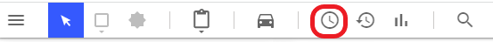

# 6. Geavanceerd: Scenario’s

## 6.1  Inleiding 

Scenario's zijn bedoeld om alternatieve situaties vast te leggen. Deze alternatieven kunnen 
prognoses in de toekomst zijn of simpelweg andere mogelijkheden die uitgewerkt worden. 
De functie Scenario's stelt geen voorwaarden aangaande de aard van het scenario.  
 
De menubalk heeft een blauwe achtergrond zolang de gebruiker in de Scenario's functie zit. 
 
## 6.2 Bekijken scenario's 
Scenario's bekijken gebeurt via de klok knop.
  
  
 
Na het aanklikken van het icoon past het linker paneel zich aan en 
toont de beschikbare scenario's.

 
Door het aanklikken van het scenario in het linker paneel wordt 
het scenario geactiveerd. Er kan gemakkelijk tussen de scenario's 
worden geschakeld. 
 
##6.3 Aanmaken nieuw scenario

In het linker paneel staat een knop "+ Maak een scenario". Hiermee wordt een nieuw scenario gemaakt via het volgende pop-up scherm: 

 
Een heldere naam is belangrijk voor gebruik later. Hiernaast is het ook mogelijk een datum en tijd op te geven, zodat het verloop in de tijd verduidelijkt wordt. Tot slot dient aangegeven te worden of het huidige situatiebeeld of een bestaand scenario als start genomen moet worden.

**Let op:** wanneer op de knop 'Maak scenario' is geklikt, staat het scenario nog niet automatisch openbaar. Andere gebruikers met plotrechten kunnen het wel zien maar reguliere gebruikers niet. Dit moet met de hand gedaan worden, zie hiervoor het volgende paragraaf opties van een scenario.
 
### 6.3.1 Opties van een scenario

Nadat een scenario is aangemaakt zijn een aantal opties beschikbaar welke bereikt kunnen worden via de "drie punten" rechts in het scenario-blokje. 

 

**Openbaar maken** Via deze optie kan het scenario openbaar gemaakt worden. Als scenario openbaar is, kan hier het scenario weer privé gemaakt worden. 
 
**Bewerken** Hiermee kan het huidige scenario worden bewerkt. Zie verdere details volgende paragraaf 
 
**Details bewerken** Aanpassen van titel en datum/tijd van dit scenario.
 
**Dupliceren** Dupliceren van dit scenario, daarna kan het aangepast worden.
 
**Verwijderen** Na een vraag met bevestiging kan dit scenario verwijderd worden.

### 6.3.2 Bewerken van een scenario

In het opties menu van de vorige paragraaf staat de optie Bewerken. Hiermee kan het huidige scenario worden bewerkt. In feite krijgt de gebruiker dezelfde mogelijkheden als het bewerken van het situatiebeeld. Het verschil zit in de blauwe menubalk:

  
 
Via de pijl links in de menubalk kan de gebruiker weer stoppen met het bewerken van een scenario. Indien de gebruiker de aanpassing niet heeft opgeslagen via de Opslaan knop rechts in de menubalk, dan krijgt de gebruiker een bevestigingspopup gepresenteerd. 

Hierna komt de gebruiker weer terug in het Scenario's scherm. 
