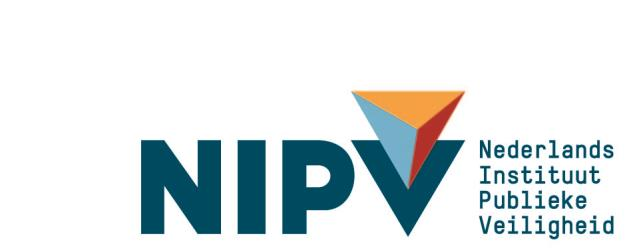

  
 
 
# Handleiding LCMS 
Plot 
 
Versie: LCMS 2024 Q1 

Nederlands Instituut Publieke Veiligheid 
Postbus 7010 
6801 HA  Arnhem 
Kemperbergerweg 783, Arnhem 
www.nipv.nl 
info@nipv.nl 
026 355 24 00 
 
 
 
**Colofon** 
Opdrachtgever: 
Martijn van der Werff  
Contactpersoon: 
Landelijk functioneel beheer
Titel: 
Handleiding LCMS Plot 
Datum: 
4 november 2024 
Status: 
 
Versie: 
LCMS 2024 Q4 
Auteurs: 
Duuk Mouris 
Review: 
Olga Navumava / Roelard Smit / Marloes Bisseling
 
Het Nederlands Instituut Publieke Veiligheid is bij wet vastgelegd onder de naam Instituut Fysieke Veiligheid.