  
 
 
# Handleiding LCMS 
Plot 
 
Versie: LCMS 2024 Q1 

Nederlands Instituut Publieke Veiligheid 
Postbus 7010 
6801 HA  Arnhem 
Kemperbergerweg 783, Arnhem 
www.nipv.nl 
info@nipv.nl 
026 355 24 00 
 
 
 
**Colofon** 
Opdrachtgever: 
Martijn van der Werff  
Contactpersoon: 
Landelijk functioneel beheer
Titel: 
Handleiding LCMS Plot 
Datum: 
4 november 2024 
Status: 
 
Versie: 
LCMS 2024 Q4 
Auteurs: 
Duuk Mouris 
Review: 
Olga Navumava / Roelard Smit / Marloes Bisseling 
 
 
 
Het Nederlands Instituut Publieke Veiligheid is bij wet vastgelegd onder de naam Instituut Fysieke Veiligheid. 

6  Geavanceerd: Scenario’s 
6.1  Inleiding 
Scenario's zijn bedoeld om alternatieve situaties vast te leggen. Deze alternatieven kunnen 
prognoses in de toekomst zijn of simpelweg andere mogelijkheden die uitgewerkt worden. 
De functie Scenario's stelt geen voorwaarden aangaande de aard van het scenario.  
 
De menubalk heeft een blauwe achtergrond zolang de gebruiker in de Scenario's functie zit. 
 
6.2  Bekijken scenario's 
Scenario's bekijken gebeurt via de klok knop. 
 
 
 
Na het aanklikken van het icoon past het linker paneel zich aan en 
toont de beschikbare scenario's. 
 
Door het aanklikken van het scenario in het linker paneel wordt 
het scenario geactiveerd. Er kan gemakkelijk tussen de scenario's 
worden geschakeld. 
 
 
 
 
 
 
 
**34/52** 
 

* * *

  
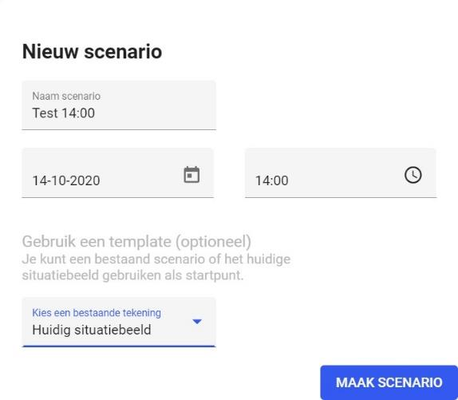  
  
6.3  Aanmaken nieuw scenario 
In het linker paneel staat een knop "+ Maak een 
scenario". Hiermee wordt een nieuw scenario 
gemaakt via het volgende pop-up scherm: 
 
Een heldere naam is belangrijk voor gebruik 
later. Hiernaast is het ook mogelijk een datum 
en tijd op te geven, zodat het verloop in de tijd 
verduidelijkt wordt. Tot slot dient aangegeven te 
worden of het huidige situatiebeeld of een 
bestaand scenario als start genomen moet 
worden. 
 
**Let op:** wanneer op de knop 'Maak scenario' is 
geklikt, staat het scenario nog niet automatisch openbaar. Andere gebruikers met 
plotrechten kunnen het wel zien maar reguliere gebruikers niet. Dit moet met de hand 
gedaan worden, zie hiervoor het volgende paragraaf opties van een scenario. 
 
**6.3.1 Opties van een scenario** Nadat een scenario is aangemaakt zijn een aantal opties beschikbaar welke bereikt kunnen 
worden via de "drie punten" rechts in het scenario-blokje. 
 
**Openbaar maken** 
Via deze optie kan het scenario openbaar gemaakt 
worden. Als scenario openbaar is, kan hier het 
scenario weer privé gemaakt worden. 
 
**Bewerken** 
Hiermee kan het huidige scenario worden bewerkt. 
Zie verdere details volgende paragraaf 
 
**Details bewerken** 
Aanpassen van titel en datum/tijd van dit scenario. 
 
**Dupliceren** 
Dupliceren van dit scenario, daarna kan het aangepast worden. 
 
**Verwijderen** 
Na een vraag met bevestiging kan dit scenario verwijderd worden. 
 
 
 
**35/52** 
 

* * *

  
  
  
**6.3.2 Bewerken van een scenario** In het opties menu van de vorige paragraaf staat de optie Bewerken. Hiermee kan het 
huidige scenario worden bewerkt. In feite krijgt de gebruiker dezelfde mogelijkheden als het 
bewerken van het situatiebeeld. Het verschil zit in de blauwe menubalk: 
 
 
 
Via de pijl links in de menubalk kan de gebruiker 
weer stoppen met het bewerken van een scenario. 
Indien de gebruiker de aanpassing niet heeft 
opgeslagen via de Opslaan knop rechts in de 
menubalk, dan krijgt de gebruiker een 
bevestigingspopup gepresenteerd. 
 
Hierna komt de gebruiker weer terug in het 
Scenario's scherm. 
 
**36/52** 
 

* * *

  
  
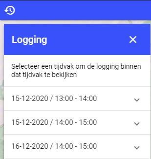  
  
7  Geavanceerd: Logging 
 
In Plot is het mogelijk om de historie van een tekening te bekijken. Hierdoor kun je de 
ontwikkeling van een tekening in verloop van de tijd terughalen. Om naar de logging 
functionaliteit te openen, klik je in het bovenste balk in het menu op het klokje met een pijltje 
eromheen. 
 
 
 
Het logging venster wordt geopend, hier zie je de tijdvakken die je kunt bekijken. 
 
 
 
Vervolgens zie je in het logging venster onder het geselecteerde tijdvak de veranderingen 
die zijn gedaan. Door een van de data en tijden te selecteren, kan je zien hoe de tekening 
zich heeft ontwikkeld. 
 
 
 
Om het logging venster te sluiten klik je op het kruisje rechtsboven in. 
 
**37/52** 
 

* * *

  
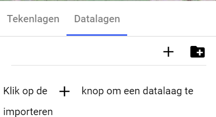  
  
  
8  Geavanceerd: Analyses 
 
Met de analysefunctie kun je een analyse uitvoeren op een specifiek gebied op basis van 
toegevoegde datalagen. Denk bijvoorbeeld aan het ophalen van het aantal verblijfsobjecten 
of kwetsbare objecten in een bepaalde woonwijk.  
Het is mogelijk om analyses uit te voeren op een eigen WFS datalagen en op de standaard 
Geo4OOV WFS datalagen. Een WFS datalaag wordt in zowel XML-structuur als html-  
structuur geaccepteerd. 
 
Om een analyse uit te voeren op objecten in de kaartlaag moet een WMS datalaag 
geconfigureerd zijn met een WFS data. 
8.1  Stap 1: datalaag configureren 
Voordat je een gebied kan analyseren moet je een 
datalaag hebben toegevoegd en geconfigureerd. 
Het toevoegen van datalagen kun je vinden in het 
hoofdstuk Aanmaken datalagen en gaat via plus 
knop: 
 
Nadat je de datalaag hebt toegevoegd selecteer je 
deze datalaag in het linker venster. Vervolgens zie 
je in het rechter venster de mogelijkheid om de 
WFS te configureren. Dit is nodig om een analyse 
uit te kunnen voeren. Klik op WFS configureren. 
 
Je klikt op WFS configureren en vervolgens op 
_Capabilities_ ophalen. Hierna wordt een drop-down 
met de "feature types" (vergelijkbaar met WMS 
datalagen) getoond. Kies het feature type dat 
overeenkomt met de datalaag. Als er een feature 
type is met exact dezelfde naam als de laag, wordt 
deze automatisch geselecteerd. 
 
Afhankelijk van de WFS is het nodig het 
correcte "Geometry attribuut" in te vullen. 
Probeer eerst of de standaardwaarde 
"geom" werkt. 
 
 
 
**38/52** 
 

* * *

  
  
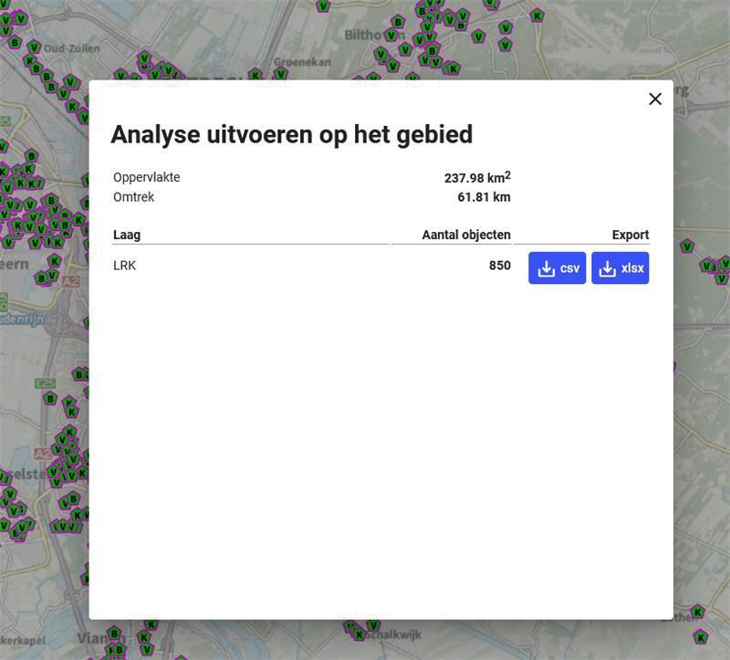  
8.2  Stap 2: Analyse uitvoeren 
Om de analyse uit te voeren klik je in het boven menu op de knop analyse (de 
staafdiagram). 
 
 
 
Selecteer het gebied waar je de analyse wilt uitvoeren, dubbel klik om het gebied te bepalen 
waarmee het gebied wordt aangegeven. De gegevens binnen dit gebied worden getoond 
(zie hieronder). De gebruiker kan vervolgens kiezen om de data van een van de lagen te 
exporteren naar een csv- of Excel-bestand. 
 
Na het kiezen van een van de download optie “csv of xlsx” kan het resultaat worden 
geopend in Excel-bestand. 
 
**39/52** 
 

* * *

  
  
  
  
  
9  Geavanceerd: meet- en 
rijopdrachten 
 
Bij meet- en rijopdrachten is het mogelijk om voertuigen en gebruikers op de kaart te zien 
bewegen en van opdrachten te voorzien. De knop voor meet- en rijopdrachten is **alleen** 
**beschikbaar** voor de huidige profielen met de rollen: 
• 
“plot opdracht verstrekker”  
• 
en “plot opdracht ontvanger”. 
 
In dit hoofdstuk worden de volgende onderdelen uitgelegd; het versturen van rijopdrachten, 
ontvangen van rijopdrachten, versturen van meetopdrachten en ontvangen van 
meetopdrachten. 
 
 
 
Wanneer de gebruiker op de knop meet- en rijopdrachten klikt verschijnt het volgende 
scherm: 
De gebruiker kiest een van deze tabbladen: rijvoertuigen of meetvoertuigen. Het rechter 
paneel past zich aan de gekozen functie links. 
 
 
_Voorbeeld menuweergave van een gebruiker met de rol “plot opdracht verstrekker” of “plot 
opdracht ontvanger”:_ 
 
 
 
_Voorbeeld menuweergave van een gebruiker met een van de overige rollen:_ 
 
 
 
 
 
**40/52** 
 

* * *

  
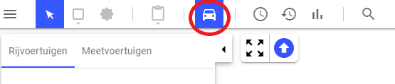  
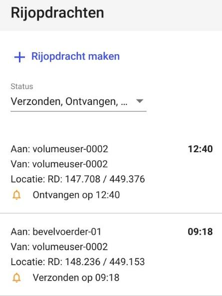  
  
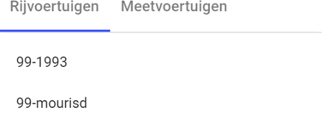  
9.1  Rijopdracht versturen 
De rollen “plot opdracht verstrekker” en “plot opdracht ontvanger” gaan rechtstreeks naar de 
rij- en meetopdrachten module om een opdracht aan te maken of aan te nemen. 
 
 
 
**9.1.1 Lijst en status van rijopdrachten** In het linker paneel wordt het tabblad Rijvoertuigen gekozen. Hier kan een gebruiker met het 
recht flankcommandant de beschikbare voertuigen zien. In het rechter paneel staan alle 
beschikbare rijopdrachten. Een gebruiker met het recht flankcommandant kan hier ook een 
nieuwe rijopdracht worden aangemaakt. 
 
Een rijopdracht gaat door een aantal statussen: 
• 
verzonden (flankcommandant)  
• 
ontvangen (automatisch na ontvangst) 
• 
geaccepteerd (bevelvoerder: plotrecht basis)  
• 
afgerond (bevelvoerder: plotrecht basis)  
• 
gesloten (flankcommandant) 
• 
ingetrokken (flankcommandant) 
 
De lijst met opdrachten kan op basis van die statussen 
gefilterd worden. 
 
 
 
**41/52** 
 

* * *

  
  
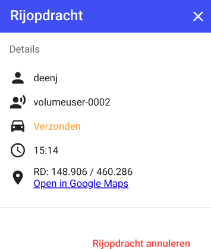  
  
  
**9.1.2 Details van een verstuurde rijopdracht** Klikken op een rijopdracht geeft de details van de rijopdracht. 
Ook kan hier de rijopdracht geannuleerd worden. Het rechter 
paneel er dan als volgt uit. Achtereenvolgens worden getoond: 
ontvanger, verzender, status, tijd dat de opdracht door de 
server ontvangen is en de coördinaten. Ook kan de rijopdracht 
geopend worden in Google Maps. Op de mobiel kan ook 
gekozen voor een andere navigatie applicatie. 
 
 
**9.1.3 Aanmaken van een rijopdracht** Een nieuwe rijopdracht wordt gemaakt door het klikken op de 
knop boven in de lijst met rijopdrachten "+ Rijopdracht maken". 
In het rechter paneel opent een nieuw scherm. De gebruiker 
met flankcommandant rechten dient vervolgens in het linker 
paneel het gewenste voertuig te selecteren en in de kaart een 
locatie te kiezen (klikken). Na klikken op versturen wordt de 
rijopdracht verzonden naar de gebruiker. 
 
 
 
9.2  Rijopdracht ontvangen 
**9.2.1 Lijst en status van rijopdrachten** In het linker paneel wordt het tabblad Rijvoertuigen 
gekozen. In dit paneel staan de beschikbare voertuigen 
waarvoor een rijopdracht gedefinieerd kan worden. Daarna 
kan de gebruiker met de rol ‘Plot opdrachten ontvanger’ zijn 
ontvangen rijopdrachten zien in het rechtertabblad. 
 
De gebruiker met de rol ‘Plot opdrachten ontvanger’ 
ontvangt de opdracht van de gebruiker met de rol ‘Plot 
opdrachten verstrekker’ en kan de opdracht accepteren en 
kan na uitvoering de opdracht afronden. 
 
 
 
**42/52** 
 

* * *

  
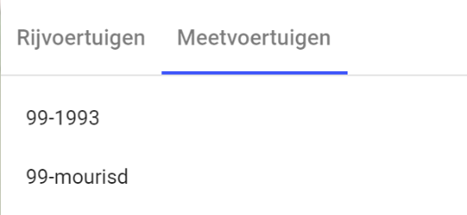  
  
  
  
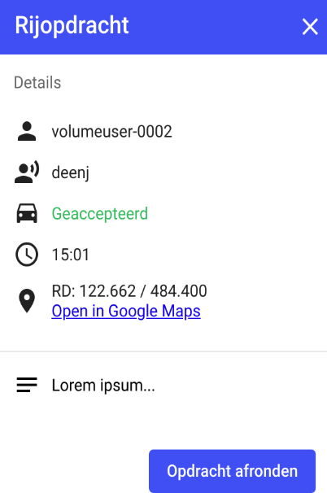  
**9.2.2 Details van een ontvangen ontvangen rijopdracht** Klikken op een rijopdracht geeft de details van de rijopdracht. Afhankelijk van de status van 
de opdracht kan de bevelvoerder hier de opdracht accepteren of afronden. 
Achtereenvolgens ziet het rechter paneel er als volgt uit. 
Afbeeldingen van links naar rechts: een ontvangen rijopdracht, een geaccepteerde 
rijopdracht en een afgeronde rijopdracht.  
9.3  Meetopdracht versturen 
**9.3.1 Lijst en status van meetopdrachten** In het linker paneel wordt het tabblad 
meetvoertuigen gekozen. Hier kan de 
meetplanleider de beschikbare voertuigen zien. 
In het rechter paneel staan alle beschikbare 
meetopdrachten. Als meetplanleider kan hier ook 
een nieuwe meetopdracht worden aangemaakt. 
 
 
 
 
 
 
 
 
 
**43/52** 
 

* * *

  
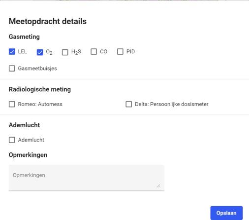  
  
  
  
**9.3.2 Details van een meetopdracht** Klikken op een meetopdracht geeft de details van de 
meetopdracht weer. Ook kan hier de meetopdracht 
geannuleerd worden. Het rechter paneel er dan als volgt uit: → 
 
Vervolgens kan de meetplanleider in een pop-up de 
meetresultaten inzien, in het geval deze al beschikbaar zijn. 
 
 
 
 
 
 
 
 
 
 
 
 
 
**9.3.3 Aanmaken van een meetopdracht** Een nieuwe meetopdracht wordt gemaakt door het klikken 
op de knop boven in de lijst met meetopdrachten "+ 
Meetopdracht maken". In het rechter paneel opent een 
nieuw scherm. → 
  
De meetplanleider dient vervolgens in het linker paneel het 
gewenste voertuig te selecteren en in de kaart een locatie te 
kiezen (klikken). In het rechtervoorbeeld is de locatie en de 
gewenste voertuigen al geselecteerd. 
 
Tot slot dient de meetplanleider de gewenste metingen te 
definiëren via de knop meetopdracht maken. 
 
 
 
 
 
 
**44/52** 
 

* * *

  
  
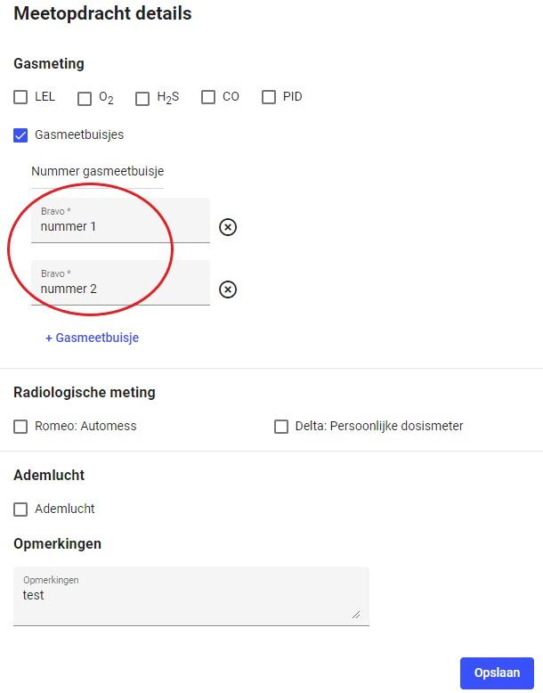  
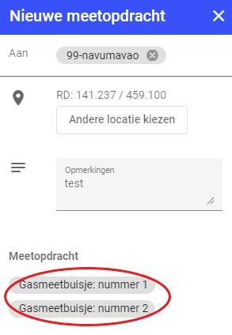  
Na het aanmaken van een nieuwe meetopdracht wordt het nummer (en eventueel extra 
tekst) weergegeven bij gasmeetbuisje.  
 
 
 
 
 
 
 
 
 
 
 
 
 
 
 
 
 
 
 
 
 
Na het verstrekken van deze details keert de gebruiker terug naar het vorige scherm en kan 
de opdracht verzonden worden. 
 
9.4  Meetopdracht ontvangen 
**9.4.1 Lijst en status van meetopdrachten** In het linker paneel wordt het tabblad 
meetvoertuigen gekozen. 
 
 
 
 
 
In dit paneel staan de beschikbare voertuigen waarvoor een meetopdracht gedefinieerd kan 
worden. Daarna kan de bevelvoerder zijn ontvangen meetopdrachten zien in het 
rechtertabblad. 
 
 
**45/52** 
 

* * *

  
  
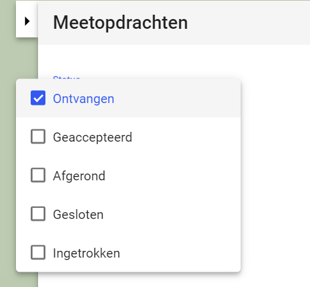  
 
 
Een meetopdracht gaat door een aantal statussen: 
• 
verzonden (meetplanleider)  
• 
ontvangen (automatisch na ontvangst)  
• 
geaccepteerd (bevelvoerder)  
• 
afgerond (bevelvoerder) 
• 
gesloten (meetplanleider)  
• 
ingetrokken (meetplanleider) 
 
De bevelvoerder ontvangt de opdracht van de 
meetplanleider en kan de opdracht accepteren en kan 
na uitvoering afronden. 
 
De lijst met opdrachten kan op basis van die statussen gefilterd worden. 
 
 
 
**46/52** 
 

* * *

  
  
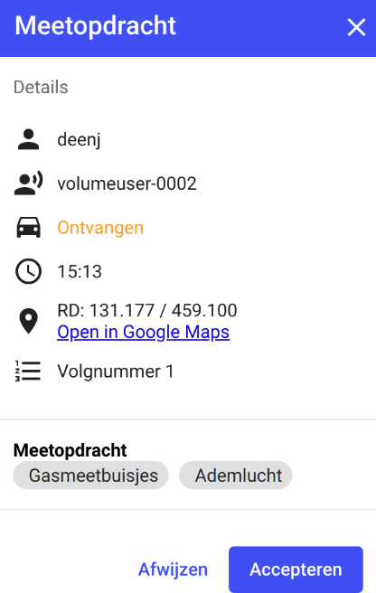  
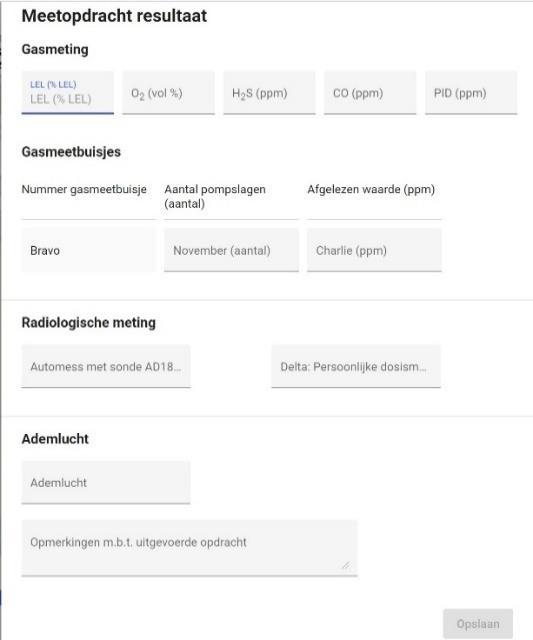  
**9.4.2 Details van een meetopdracht** Bij het klikken op een meetopdracht worden de details van de 
meetopdracht weergegeven. Afhankelijk van de status van de 
opdracht is het mogelijk voor de bevelvoerder de opdracht te 
accepteren of te afronden. Het rechter paneel ziet er als volgt 
uit: → 
 
 
 
 
 
 
 
 
 
 
Nadat de bevelvoerder de meetopdracht 
geaccepteerd verschijnt er nu de knop 
Meetresultaten invullen. Bij selectie van deze 
verschijnt er een dialoogvenster, waarin alle 
meetgegevens ingevuld kunnen worden. Als de 
meetresultaten goed zijn kan men die opslaan met 
de knop rechts onderin. Na het opslaan van 
meetresultaten kan op de knop onderin op de 
opdracht afgerond en verstuurd worden. 
 
 
 
 
 
 
 
9.5  Locatie bij Meet- en Rijopdrachten 
In de module Meet- en Rijopdrachten verandert de locatieknop (onder de zoomknop). In 
deze module bevat de locatie GPS 4 stappen. De volgorde van functionaliteiten gaat van 1 
naar 4 en dan weer terug naar 1. Bij inloggen start je bij 1. 
 
 
 
De volgende iconen beteken het volgende: 
1. 
Blauw GPS symbool met punt in het midden: Blijf GPS positie volgen met kaart. 
2. 
Pijl symbool: je afgelegde route wordt als kruimelpad getoond. 
3. 
Grijs GPS symbool met een streep: GPS positie staat uit. 
4. 
Grijs GPS symbool zonder streep: eenmalig centreren op GPS positie. 
 
**47/52** 
 

* * *

  
  
  
10 Geavanceerd: Import en 
export van kaartlagen 
 
In het rechter paneel ziet de gebruiker op het tabblad eigenschappen onderaan twee 
knoppen voor het importeren en exporteren van tekenlagen of van objecten. 
1. 
Objecten importeren (linker knop) 
a. 
Uit een bestand  
b. 
WFS als tekenlaag 
2. 
Exporteren naar GeoJSON (rechter knop) 
 
10.1 Importeren uit een bestand 
**10.1.1 Importeren** Objecten kunnen in een bestaande tekenlaag worden geïmporteerd. Vanuit de 
eigenschappen venster wordt de import-knop gekozen. Daar volgt een pop-up scherm waar 
het bestand gekozen kan worden. 
 
 
**48/52** 
 

* * *

  
  
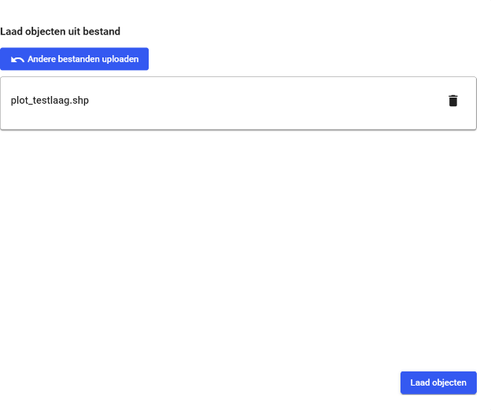  
Na het laden wordt het bestand in een 
lijst weergegeven.  
Het bestand kan daar weer gewist 
worden. Ook is het mogelijk nog andere 
bestanden te laden. Deze worden alle in 
de tekenlaag opgenomen na het klikken 
op de Laad objecten-knop. 
 
De objecten zitten nu in de kaartlaag en 
worden op de kaart getoond. Deze 
objecten kunnen op dezelfde manier 
bewerkt worden als zelf getekende 
objecten. 
 
 
**10.1.2 Objecten importeren uit een bestand met filter** Als er objectinformatie wordt 
meegeleverd met de kaartlaag dan 
wordt het formulier uitgebreid met 
twee functies: 
1. 
Attribuut dat gebruikt moet 
worden voor label bij object. 
2. 
Attribuut waarop gefilterd 
wordt bij import. 
 
Het filter zorgt ervoor dat alleen 
objecten worden geladen die een 
attribuutwaarde hebben 
overeenkomstig het filter. Het filter 
kan ook leeg gelaten worden; alle 
objecten tot een maximum van 
100 worden geladen op de kaart. 
 
 
 
 
**49/52** 
 

* * *

  
  
  
**10.1.3 Default symbool, kleur en label aangeven bij importeren** Een kleur en label kunnen worden meegeven bij het importeren van een object uit een 
Shape bestand. De bestanden die geïmporteerd kunnen worden zijn: CSV, Geojson en 
Shapefile. Een kanttekening is dat het juiste formaat van de bestanden gebruikt moeten 
worden, anders zal het niet werken.  
 
 
10.2 Import WFS als tekenlaag 
Een WFS-datalaag kan worden geïmporteerd als een tekenlaag zodat deze aangepast kan 
worden zonder te synchroniseren met de datalaag. 
 
 
Klik rechtsonder op het icoon “Objecten importeren” en selecteer “Geoserver”.  
 
 
**50/52** 
 

* * *

  
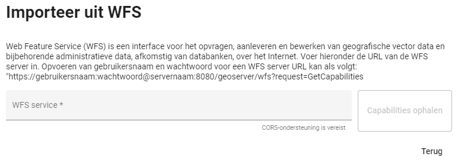  
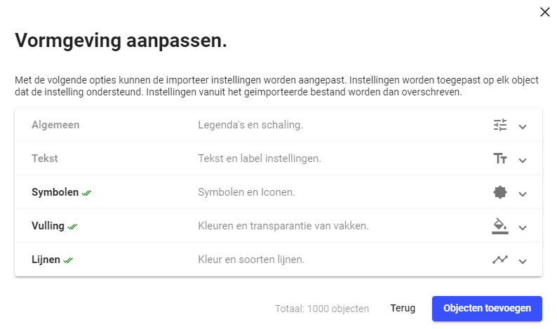  
  
  
Vul de URL van de WFS-server in en klik op ‘Capabilities ophalen’. 
 
Als de server eigenschappen (capabilities) zijn opgehaald, worden de beschikbare lagen 
getoond. 
 
Het is mogelijk om de objecten op te maken; o.a. symbool, vulling of lijnkleur. 
 
 
Na het laden en “Objecten toevoegen” wordt de WFS-laag als tekenlaag toegevoegd: 
 
**51/52** 
 

* * *

  
  
10.3 Exporteren tekenlaag naar GeoJSON 
**10.3.1 Exporteren alle objecten tekenlaag** Het exporteren van alle objecten van een tekenlaag, 
voor gebruik van een andere applicatie dan LCMS 
kan alleen via GeoJSON.  
Via de import-functie kunnen deze objecten ook weer 
geladen worden. Let op dat GeoJSON WGS84 
coördinaten gebruikt. 
 
 
 
 
 
 
 
 
 
**10.3.2 Eén object exporteren naar GeoJSON** Naast hierboven genoemde exporteren van een gehele tekenlaag, is het mogelijk om enkele 
objecten te exporteren. Dit kan gedaan worden door op één object te klikken en dan op de 
export knop te klikken onderaan. 
 
**52/52** 
 

* * *