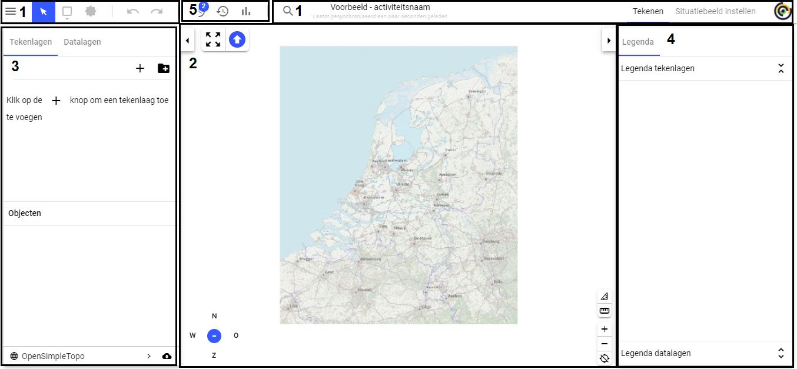

# 1 Inleiding

LCMS Plot geeft gebruikers de mogelijkheid om het grafisch beeld van een activiteit (bijvoorbeeld van een incident of evenement) te delen. Dit grafisch beeld wordt opgebouwd aan de hand van symbolen en objecten op een kaarten. Daar bij is het mogelijk om dit grafische beeld te delen tussen verschillende teams, organisaties en andere domeinen.

Om ervoor te zorgen dat de onderlinge communicatie in goede banen geleid wordt is het systeem voorzien van een lagenmanager. Ieder team kan dan een eigen laag aanmaken gebruiken. Hierdoor kan alle grafische data gefilterd worden en treedt geen overdaad op aan zichtbare data.

Gebruikers kunnen de grafische informatie publiceren voor gebruikers met en zonder plot rechten.

## 1.1 E-learning
Er is voor Plot een e-learning gemaakt. Deze cursus is geschikt voor beginnend LCMS gebruikers of gebruikers die zijn/haar kennis op willen frissen. Link[: https://lcms.nl/e-learning](https://lcms.nl/e-learning) 

## 1.2 Indeling document

Wanneer plot geopend wordt zal men onderstaande scherm zichtbaar zijn.

De volgende hoofdstukken komen aan bod en zijn aangeduid met een nummer in 
bovenstaande scherm: 

1. De menubalk 
2. Kaart met tools  
3. Tekenlagen, groepen, datalagen
4. Legenda 
5. Geavanceerde functies: Scenario’s, Logging, Analyses  
 
De volgende geavanceerde functionaliteiten zijn niet weergeven op bovenstaand schermafdruk. Deze functionaliteiten zijn niet direct te zien wanneer een plot gebruiker plot opent. Echter worden ze wel omschreven.

- Meet- en rijopdrachten 
- Import en export van kaartlagen. 
 
1. Met uitzondering opensimpletopo omdat die wordt behandeld in bij kaart met tools. 
