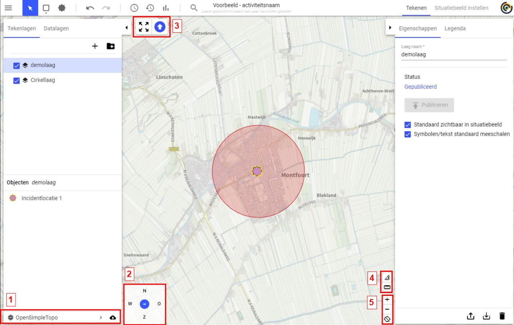
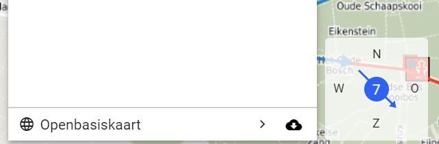
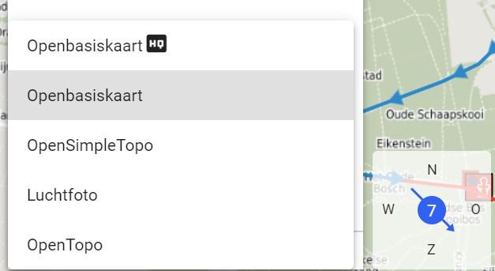
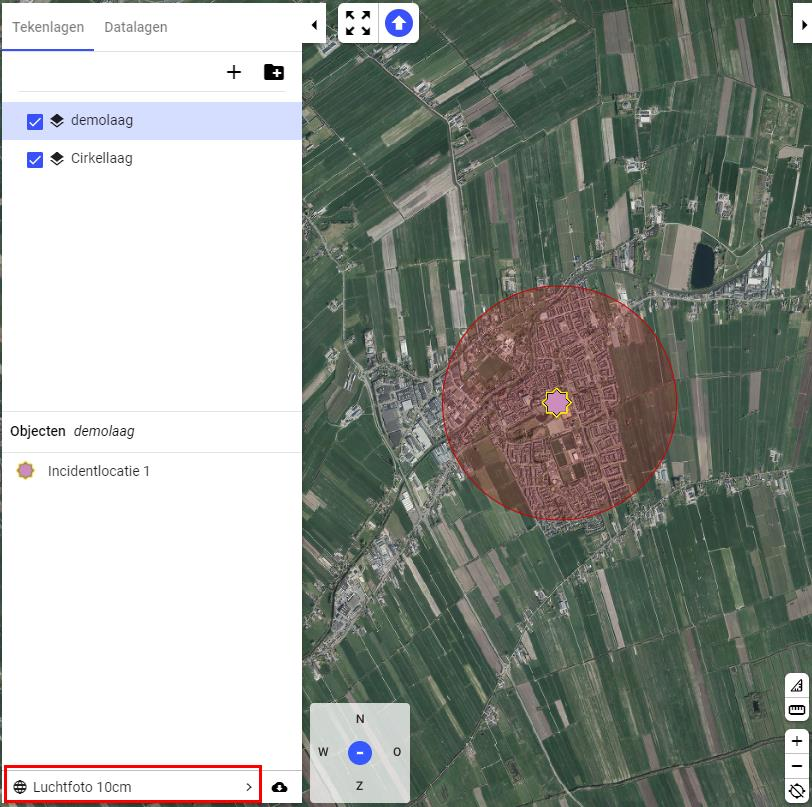
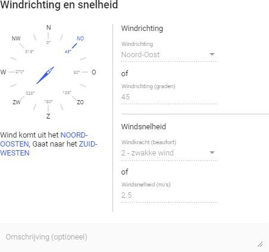
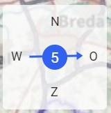
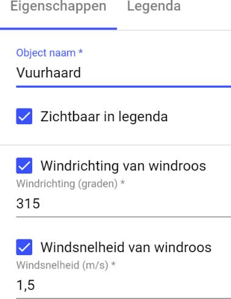
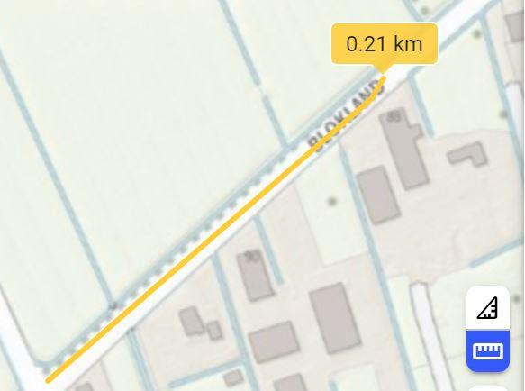
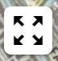
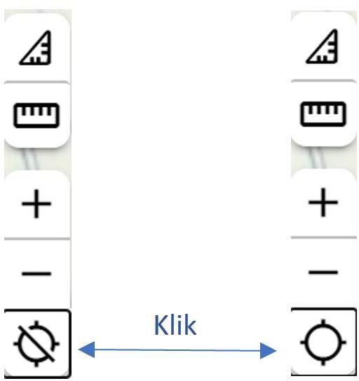

# 4. Kaart met tools

  
  
 
De volgende knoppen zijn te vinden op de kaart: 
1. De getoonde achtergrondkaart aanpassen.  
2. De windroos  
3. Zoom naar alle objecten. 
4. Oppervlakte meten en afstand meten. 
5. Zoomen en locatie. 

## 4.1 Achtergrondkaart
Binnen Plot kunnen meerdere achtergrondkaarten worden gekozen. Dit kan in het linker paneel onderaan: 

  
  

Na het klikken op de Basiskaart, opent een uitrolmenu waar een andere achtergrond 
gekozen kan worden: 
 
Voorbeeld van een andere achtergrondkaart de luchtfoto: 

  
  
  

## 4.2  Windroos

De windroos geeft informatie over de windrichting en windsnelheid. Deze moet door de gebruiker zelf ingevuld worden. De windroos bevindt zich links onderin. 
 
### 4.2.1 Windroos instellen

Deze richting is aan te passen door op de windroos te klikken In dit scherm kan de windrichting en windsnelheid worden ingegeven. Daarnaast is er nog een optionele omschrijving toe te voegen.
 
### 4.2.2 Windroos en gasmallen en vuurhaarden

Naast het weergeven van de windrichting en windsnelheid 
heeft de windroos invloed op de gasmal en vuurhaard. Bij het 
invoegen van een gasmal of een vuurhaard kan aangegeven 
worden of de waarden van de windroos moeten worden 
overgenomen. Als na het tekenen de windroos wordt 
aangepast dan wordt ook de vuurhaard of gasmal aangepast, 
zolang het vinkje daar aanstaat voor overnemen van 
windroos. 
 
 
  
  
  

## 4.3  Zoom naar alle objecten

Linksboven op de kaart staat de volgende knop: 
 
Wanneer deze knop wordt geselecteerd zoomt de kaart naar alle getekende objecten op de 
kaart. Afhankelijk van de ligging van de objecten kan dit een groot of klein deel van de kaart 
zijn. 
 
## 4.4  Oppervlakte meten en afstand meten 
Er is de mogelijkheid om op de kaart oppervlakte of afstand te meten. Deze knop 
is rechts onderin te vinden. Hieronder is te zien dat dat de oppervlakte meten is 
geselecteerd. De knop eronder is afstand meten. 
 
Om de resultaten van de meting weg te halen klik op de actieve blauwe oppervlakte- of 
afstand meten knop. 
 
 
 
Een voorbeeld hoe dit er uitzien bij afstand meten. 
 
## 4.5  Zoomen, slepen en locatie 

### 4.5.1 Zoomen en slepen

De kaart wordt in principe bediend door middel van de muisknoppen en -wiel.  
• 
Het verslepen van de kaart wordt gedaan door de kaart te selecteren en te slepen; 
• 
Via het muiswiel kan de kaart in- en uitgezoomd worden; 
• 
Op een tablet gaat dit via ‘pinchen’, met twee vingers elkaar of naar elkaar bewegen;  
• 
Als extra mogelijkheid staan rechtsonder een ‘+’ en ‘-‘ knop om in- en uit te zoomen. 
 
  

### 4.5.2 Locatie
Onder de zoomknoppen bevindt zich de locatieknop. Bij inschakelen zoomt de kaart naar de 
huidige locatie. Plot bepaalt de locatie op basis van GPS en Wifi (IP adres).  
Wanneer hier problemen zijn controleer de 
instellingen van de browser. Als het apparaat 
waarop gewerkt geen gps signaal heeft, wordt de 
locatie bepaald op basis van IP adres. Dit is niet 
nauwkeurig, zeker niet als men ook werkt in een 
virtuele omgeving (zoals bijvoorbeeld Citrix). 
 
Er wordt een marker op die locatie geplaatst en 
wordt continu geüpdatet met de actuele positie. Als 
de locatie aan staat en er wordt op geklikt dan wordt 
de marker weggehaald. 
 
In het hoofdstuk [Geavanceerd: meet- en rijopdrachten](geavanceerd_rijopdrachten.md) worden de relevante locatiefuncties uitgelegd voor Meet- en rijopdrachten. 
