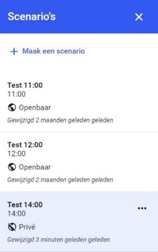

# 5. Legenda

 
In het rechter paneel staat een tabblad met de naam Legenda. De legenda bestaat uit twee 
onderdelen: 
1. Legenda tekenlagen 
2. Legenda datalagen  
 
## 5.1  Legenda tekenlagen 
In deze legenda staan alle getekende objecten met 
een icoon/verbeelding plus een label. Omdat veel 
objecten de legenda minder goed leesbaar kunnen 
maken is het mogelijk om objecten uit de legenda te 
halen. Dit kan op twee manieren: 
1. klik op het oog-teken rechts naast het legenda-  
item; 
2. klik op het object in de tekenlagen tab in het 
linker paneel en ga vervolgens naar 
eigenschappen in het rechter paneel, zet 
selectievak uit voor Zichtbaar in legenda. 
 
Als een legenda-item is uitgezet in de legenda zelf, 
dan kan dit item alleen weer aangezet worden via de 
eigenschappen van het object (punt 2 hier boven). 
 
## 5.2 Legenda datalagen 
Als er een datalaag is toegevoegd dan zal er ook een 
legenda weergeven worden van de datalagen. Datalagen 
worden via een service opgehaald. Vaak levert zo'n service 
een legenda mee.  
Deze legenda wordt zonder verder bewerking voor de 
verschillende datalagen in de legenda getoond. Indien de 
service geen legenda levert, kan deze vanzelfsprekend niet 
getoond worden. 
Voorbeeld van een legenda van de datalaag: “Witte Kaart 
GHOR”. 
 
  
  
  