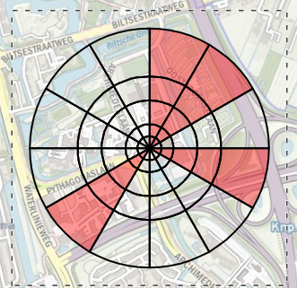
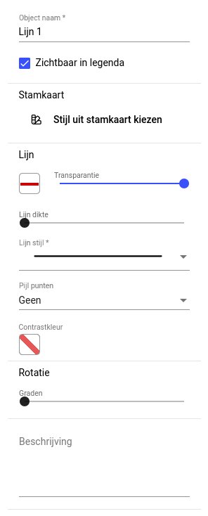

# 3. Menubalk 

De menubalk bestrijkt de gehele bovenkant van het scherm.

Bij erg smalle schermen zal een deel van de opties onzichtbaar zijn.

De menubalk bestaat uit meerdere onderdelen van links naar rechts:

1. Hamburgermenu: Onder de knop  vinden we extra opties en instellingen.
2. Selecteren: Wanneer de blauwe pijl  actief is kunnen objecten in de kaart geselecteerd worden.
3. Tekenen: Met het vierkant  kunnen objecten worden getekend, met de ster  kunnen symbolen worden geplaatst.
4. Bewerkmenu:  Met deze functie kunnen symbolen en objecten gekopieerd, geknipt en geplakt worden, undo- en redo-functie.
5. Geavanceerde functies: Hier kunnen  [scenario’s](geavanceerd_scenarios.md),  [logging](geavanceerd_logging.md) en  [analyses](geavanceerd_analyses.md) worden ingesteld.
5. Zoeken: Met deze functie  is het mogelijk om op locaties en markeringen te zoeken zoals adres, coördinaten, buurten, postcodes, hectometerbordjes en raaipalen. 
6.  Informatie over de naam van de activiteit en het laatste moment waarop er gepubliceerd is.
7. Met _Tekenen_ en _Situatiebeeld instellen_ kan er tussen ‘Tekenen’ en ‘Situatiebeeld instellen’ gewisseld worden. Met een blauwe balk onder een van beide opties is zichtbaar welke functie actief is.
8. Logo: Onder het logo  vinden we inloginformatie en de mogelijkheid om uit te loggen.
 
## 3.1 Hamburgermenu

Het hamburgermenu biedt extra functies binnen plot. De onderdelen worden kort benoemd.

 
- **Terug naar LCMS Tekst** Met deze knop wordt geschakeld naar LCMS tekst. Hiermee wordt LCMS plot wordt afgesloten. De knop verdwijnt als je LCMS tekst afsluit. 
- **Wijzigingen opslaan**  Met de knop ‘Wijzigingen opslaan’ kunnen de wijzigingen in de 
tekening opgeslagen worden. _**N.B.:** Een eerder gepubliceerde tekenlaag, wordt opnieuw gepubliceerd met de wijziging. Een niet gepubliceerde tekenlaag wordt opgeslagen. Dan is deze laag alleen zichtbaar voor gebruikers met schrijfrechten._
- **Activiteit openen** Via een dialoogvenster kan een andere activiteit geopend waarvoor de gebruiker toegang heeft.
- **Activiteit koppelen** Een tekening van een andere activiteit kan gekoppeld worden aan de huidige activiteit via een dialoogvenster. Op basis van de rechten van de gebruiker ziet men de te koppelen activiteiten. 
- **Printen** De printen knop biedt de mogelijkheid om na instellen, een print te maken van de kaart en op te slaan als pdf. Het huidige zoom niveau binnen plot wordt in de print overgenomen. 
- **Tekenen, Situatiebeeld instellen, Scenario's, Logging en Analyse** dit zijn de opties die ook al in de menubalk aanwezig zijn, deze bevinden zich ook onder dit hamburgermenu zodat ze op kleine schermen ook beschikbaar zijn. 
- **Handleiding** Door op deze optie te klikken zal deze handleiding openen.
- **Applicatie verversen** Met de knop applicatie verversen (net zoals snelkoppeling F5). De gebruiker kan hier: een andere domein en profiel te kiezen en de nieuwste versie van plot ophalen.
- **Over** Met de knop “over”. Hier worden de technische details van de applicatie opgevraagd, zoals het versienummer. De informatie die getoond wordt is met name handig voor ontwikkelaars en het vermelden waard bij het rapporteren van fouten.
 
## 3.2 Tekenen 

De tekentool  bevat een menu. 
 

De optie _Meer_ bevat ook weer een menu.

Bij een aantal opties in het menu wordt een letter getoond. Dit is een zogenaamde _sneltoets_. Door op een willekeurig moment tijdens het gebruik van plot een aan een sneltoetst gekoppelde letter op het toetsenbord in te drukken (mits er op dat moment geen tekstvak wordt gevuld) kan met de sneltoets direct een teken-actie worden gestart. _De sneltoets is **niet** hoofdletter gevoelig_. In de volgende paragrafen wordt uitgelegd hoe deze tools functioneren. 
 
 
### 3.2.1 Label, lijn, cirkel, ellipse en rechthoek

In het eerste menu dat openklapt bij de optie _Tekenen_ bevinden zich label, lijn, cirkel, ellipse en rechthoek.

Labels, lijnen, cirkels, ellipsen of rechthoeken kunnen geplaatst of getekend worden door in het menu op het betreffende menu-item te klikken of door gebruik te maken van sneltoetsen. Met de _escape_ toest wordt tekenen altijd afgesloten.

Wanneer een object is getekend en de tekenactie correct is afgesloten, dan verschijnt het object als _geselecteerd_ op de kaart, te herkennen aan een dunnen stippellijn.

Wanneer een tekenactie wordt afgesloten opent aan de rechterzijd van het scherm altijd het _eigenschappen_ venster. In dit venster kunnen een aantal eigenschappen van het getekende object worden ingesteld of gewijzigd.

In het eigenschappen venster zijn de volgende opties beschikbaar:

**Object naam**: wordt gebruikt om het object te herkennen tussen de objecten en legenda. 

**Zichtbaar in Legenda**: Bepaalt of dit object in de legenda wordt opgenomen. 

> Bij veel objecten van het zelfde type kan het handig zijn deze niet op te nemen in de legenda. Staat standaard aan. 

**Stamkaart**: Het is mogelijk om een stijl uit de stamkaart te kiezen. 

> Als er vervolgens op de kaart getekend wordt, dan wordt het object weergegeven in een standaard opmaak uit de stamkaart. Bij _Labels_ is deze mogelijkheid **niet** aanwezig. 

**Vulling en lijn**: Bij ieder object zijn er eigenschappen waar een kleur kan gekozen worden. Door op de kleur te klikken, verschijnt er dan een kleurenkiezer. 

> Uit de kleurenkiezer kan een kleur worden gekozen of er kan handmatig een kleur worden ingevoerd in de formaten `rgb(255, 99, 71)` of `#ff6347`. Let hierbij op de spaties, de kleurenkiezer zal aangeven of een handmatige kleur wel of niet geldig is.

> Naast de gekozen kleur kan ook de transparantie worden ingesteld en bij lijnen kan ook een lijndikte worden meegegeven.

**Rotatie**: De tekenobjecten kunnen gedraaid/geroteerd worden.

 
> Bij verschillende objecten kan het eigenschappen venster meer of minder mogelijke instellingen hebben. Ze hebben bijvoorbeeld cirkel, sectormal, vuurhaard en foto geen _rotatie_ optie en hebben gasmal en vuurhaard een (wind)richting die er voor zorgt dat het object wordt gedraaid. Een label kan rond zijn positie roteren. De cirkel en sectormal zijn ronde objecten, hiervoor is rotatie overbodig.

**Beschrijving**: Bij een object is het ook mogelijk om een beschrijvingen mee te geven. Deze informatie is enkel voor de gebruikers van LCMS plot zichtbaar en wordt niet zichtbaar op het kaartbeeld.

### 3.2.2 Sectormal, Vuurhaard, Gasmal, Raster, Spline en Foto

Voor meer complexe of specifieke objecten zijn speciale tekenfuncties beschikbaar. Klik op de  tekenknop, en vervolgens op _meer_. 

> Er kan ook gebruik gemaakt worden van de sneltoetsen **G** voor raster, **V** voor spline en **F** voor foto.
 
#### Sectormal

In het veld ‘Sector(en)’ worden de sectoren gescheiden door middel van een komma. Er kan een keuze gemaakt worden van 1 tot en met 12 sectoren. Onder Segment wordt ingevuld tot welk segment de sectormal moet worden gevuld (A-E). De bijbehorende afstanden worden automatisch bepaald op basis van de straal van de sectormal.

#### Vuurhaard
De windrichting en de windsnelheid kunnen voor de vuurhaard en gasmal worden ingevuld. Het is ook mogelijk aan te vinken dat de richting en snelheid overgenomen moeten worden van de windroos, welke linksonder op de kaart ingesteld kan worden. 

> **Let op:** als windrichting van de windroos later wordt aangepast, dan wordt ook deze vuurhaard aangepast!
 
#### Gasmal

De malkleur, het malnummer en windrichting, kunnen voor de gasmal worden ingevuld. Het is ook mogelijk aan te vinken dat de windrichting moet worden overgenomen van de windroos, welke linksonder op de kaart ingesteld kan worden. 

> **Let op:** als de windrichting van de windroos later wordt aangepast, dan wordt ook deze gasmal aangepast!

#### Raster

Een raster is beschikbaar zodat deze bijvoorbeeld bij evenementen of activiteiten waarbij meerdere instanties betrokken zijn in Plot gezet kan worden. Door  en hierdoor de locatie snel kan worden aangewezen. Er kan **maximaal één raster** geplaatst worden in Plot. Het maximaal aantal sectoren in een raster is 15.000. De eigenschappen van een raster kunnen aangepast worden.

> In de bovenstaande afbeelding zijn niet alle eigenschappen zichtbaar. Door naar beneden te scrollen komen de opties _Coördinaten_, _Rotatie_ en beschrijving ook in beeld.

- **Object naam**: hier staat standaard “Raster 1”, dit kan aangepast worden.
- **Zichtbaar in legenda**: staat standaard aan.
- **Tekstlabel:** Van het tekstlabel in het raster is het volgende in te stellen:
  - Tekstgrootte;
  - Rotatie;
  - Tekst kleuren;
  - Tekstvak kleuren;
  - Lijn transparantie, dikte en stijl.
- **Raster**: de grootte van de vakken kan aangepast worden in meters, aantal rijen en aantal kolommen.
- **Coördinaten**: De exacte X- en Y-coördinaat van het Rijksdriehoekstelsel of de WGS84 (GPS) lengte- en breedtegraad kunnen handmatig worden ingegeven.

>  De coördinaten veranderen wanneer het raster wordt verplaatst op de kaart. Indien WGS84 coördinaten handmatig worden ingevoerd zullen de Rijksdriehoekstelsel coördinaten mee veranderen en vice versa

- **Rotatie**: hiermee kan het rasrer geroteerd worden. Het tekstlabel roteert niet met het raster mee, dit moeten bij de rotatie onder tekstlabel.

#### Spline

Voor het tekenen van een spline (vrij tekenen) kan een voorbeeld uit de stamkaart worden gekozen. 

> Een spline heeft dezelfde eigenschappen als de lijn.
 
#### Foto

Naast objecten kunnen ook foto's op de kaart geplaatst worden. Na het kiezen van foto uit het menu of de sneltoets **F** wordt in de kaart de locatie aangeklikt waar de foto geplaatst moet worden. Hierna opent een dialoog waarmee de foto kan worden toegevoegd.

> In de dialoog is te zien hoe groot de foto mag zijn, maximaal 5 MB.

> In het voorbeeld wordt de afbeelding gebruikt van de AA1919 carsh site van [wikimedia](https://commons.wikimedia.org/wiki/File:AA191-crash-site.png). Dit is een licentievrije foto.

Nadat een foto is bijgevoegd kunnen er nog bewerkingen worden uitgevoerd zoals roteren en het maken van een uitsnede.

Nadat de foto is opgeslagen verschijnt een camera-icoon op de kaart geplaatst.

 De foto zelf wordt getoond in de eigenschappen en kan daar eventueel worden getoond.

### 3.2.3 Incidentlocatie en symbolen

In deze paragraaf wordt er uitleg gegeven over de **incidentlocatie** en andere symbolen die onder de  **ster knop** beschikbaar zijn. Wanneer op de ster knop wordt gedrukt verschijnt in het rechterpaneel het _Symbolen_ venster.

> **Let op:** controleer altijd of er voor symbolen wellicht datalagen beschikbaar zijn op [Geo4OOV](https://kaart.geo4oov.nl/geo-beheer/app/catalogue/servers). In een vorige versie van de documentatie werd bijvoorbeeld aangegeven hoe een brandkraan kon worden getekend maar hiervoor is een datalaag beschikbaar te weten _"[Brandkranen-landelijk](https://kaart.geo4oov.nl/geo-beheer/app/catalogue/servers/server/45XPTGYUR6G1E4EBQX9YOJ63KXIIGW)"_

> Standaard is het incidentlocatie-symbool geselecteerd. Echter kan ook meteen in het rechter paneel een ander symbool gekozen worden.

Onder ‘Kies een categorie’ zit een selectie menu waar alle [afzenders](../symbolenset/index.md#afzenders) staan en één voor één geselecteerd kunnen worden: 
Verder kan er gezocht worden op naam door deze in te vullen bij “Filter Symbolen”. Voor de (zoek)benaming van deze symbolen kan je over de symbolen heen ‘hoveren’. Door op de pijl in de menubalk te klikken of gebruik te maken van de sneltoets escape is het mogelijk om te stoppen met iconen plaatsen. Het symbool kan weer geselecteerd worden om de eigenschappen te 
veranderen of te verplaatsen.

 
Extra toelichting op de opties:

- **Zichtbaar in legenda**: Bepaalt of dit object in de legenda wordt opgenomen. 
- **Object meeschalen**: Wanneer object meeschalen is aangevinkt krijgt het symbool een vaste grootte. Schalen van symbolen/tekst **staan standaard uit**, zodat de symbolen zonder te ver in te zoomen al duidelijk zijn.
- **Label tonen**: Met het aanvinken van label tonen kan er tekst worden getoond naast het symbool. 
- **Symbool**: Hier kan het symbool gewijzigd worden

### 3.2.4 Schalen van symbolen/tekst

In tekenlagen van Plot staat schalen van symbolen/tekst **standaard uit**, zodat de symbolen bij ver uitzoomen duidelijk zichtbaar blijven. 

Dit is ook zichtbaar wanneer een symbolen/tekst geplot is. Zodra er op een symbolen/tekst aan de linker paneel geklikt wordt, zijn de ‘Eigenschappen’ en ‘Legenda’ van het symbool zichtbaar. In dit paneel staat het vinkje voor ‘Object meeschalen’ standaard uit.

### 3.2.5 Verplaatsen objecten over tekenlagen

Het is mogelijk om objecten van een tekenlaag naar een andere tekenlaag te verslepen. Klik en sleep het object in het linker paneel naar een andere tekenlaag boven in het in het paneel verplaatst. 

 
## 3.3 Bewerkmenu 

Er zijn een aantal functies beschikbaar in de menubalk onder de knop .

- de uitgevoerde actie ongedaan maken _(undo)_ of opnieuw uitvoeren _(redo)_
- symbolen en objecten kopiëren, knippen of plakken
- symbolen verwijderen

> Als een gebruiker per ongeluk iets verplaatst dan kan deze met de knop met pijltjes maximaal 5 stappen terug (undo) en vooruit (redo). De sneltoetsen Ctrl-Z (undo) en Ctrl-Y (redo) zijn hier ook voor beschikbaar. 
 
De stappen terug en vooruit zijn beperkt en hebben enkel effect op: 
 
| Object | Acties | Undo | Redo |
| --- | --- | --- | --- |
| Symbool | plaatsen, verplaatsen, kopiëren, knippen, plakken en verwijderen | Ja | Ja |
| Label, lijn, cirkel, ellips, rechthoek, sectormal, spline | plaatsen, verplaatsen, wijzigen, kopiëren, knippen, plakken en verwijderen | Ja | Ja |
| Vuurhaard, gasmal | plaatsen, verplaatsen, handmatig wijzigen, kopiëren, knippen, plakken en verwijderen | Ja | Ja |
| Foto | plaatsen, verplaatsen, kopiëren, knippen, plakken en verwijderen | Ja | Ja |

## 3.4 Zoeken 

Via de zoekfunctie  in de menubalk kan op verschillende manieren worden gezocht wat uiteindelijk het kaartbeeld naar de gewenste locatie zal verplaatsen.

### 3.4.1 Adres

De locatie wordt opgevraagd bij de [PDOK Locatieserver](https://www.pdok.nl/restful-api/-/article/pdok-locatieserver-1), een algemene geocodeerservice van de overheid (PDOK). Er worden meerdere opties weergegeven indien beschikbaar, gerangschikt naar de dichtstbijzijnde locatie. Door op een van de opties te klikken zoomt de kaart naar die locatie. 

### 3.4.2 Rijksdriehoek

Hiernaast kun je ook Rijksdriehoek (RD)-coördinaten invoeren, bv: `83800,435600`. De zoekfunctie geeft dan de optie: `XY-coördinaat (83800,435600)`. Als er geklikt wordt op deze 
optie zoomt de kaart daar naartoe. 

### 3.4.3 WGS84

Er kan gezocht worden op WGS84 (GPS)-coördinaten in volgende format: `52.1408, 5.0444`. Als er geklikt wordt op deze optie zoomt de kaart daar naartoe. 

### 3.4.4 Hectometerpaal

Ook kan er gezocht worden op hectometerpalen met volgend format snelweg hectometernummer. Bijvoorbeeld je zoek A12 hectometerpaal 124: dan zoek je `A12 1240`. Als men klikt op Hectometerpaal zoomt de kaart naar de locatie. Indien dit niet goed werkt dient de locatie uit worden gezet in de browser. De zoeklocatie wordt op de kaart gemarkeerd. Door op het kruisje te klikken sluit het zoekpaneel.

## 3.5 Situatiebeeld instellen

Met het instellen van het situatiebeeld geeft een gebruiker aan wat gebruikers zonder plotrechten standaard zien in het grafisch beeld van de activiteit.
 
### 3.5.1 Schakelen tussen tekenen en Situatiebeeld instellen

De applicatie heeft rechts bovenin een schakelaar met twee standen: "Tekenen" en "Situatiebeeld instellen". De applicatie start standaard met "Tekenen" geselecteerd.

Na het selecteren van ‘Situatiebeeld instellen’ opent plot in een vereenvoudigde vorm. De optie om tekenlagen en groepen toe te voegen verdwijnt, en de titel ‘Situatiebeeld instellen’ verschijnt links (zie schermafbeelding hieronder). 
 
Het is mogelijk om de tekenlagen en de datalagen aan te vinken die in het situatiebeeld standaard zichtbaar moet zijn. Alleen gepubliceerde kaartlagen zijn hier zichtbaar.

 