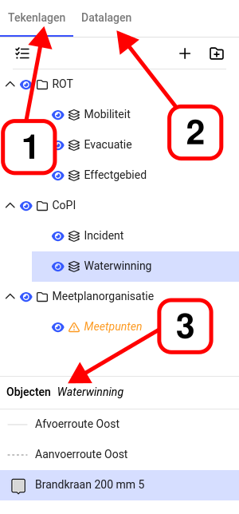
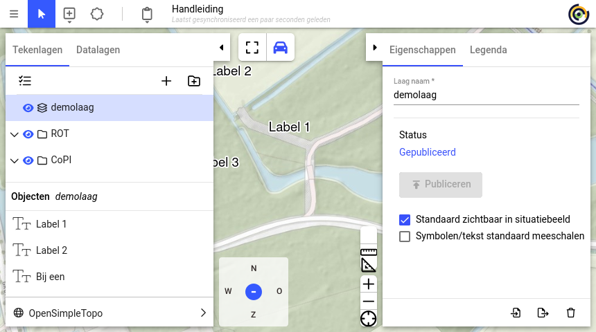
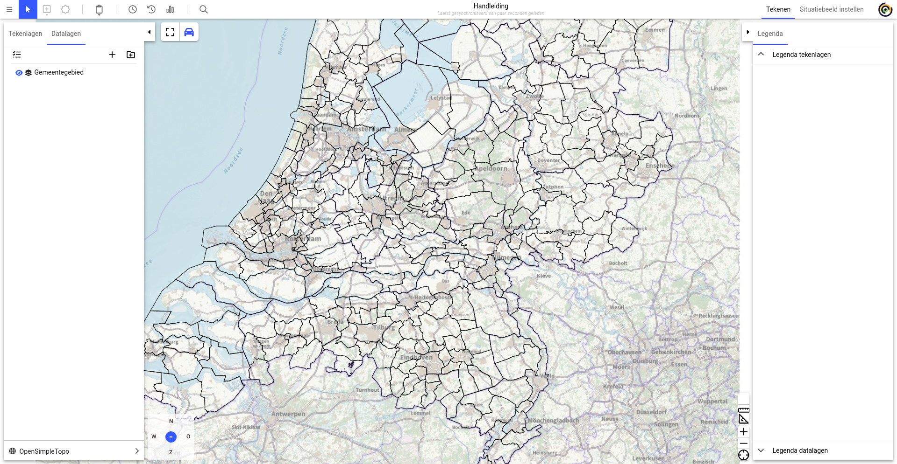

# 2. Tekenlagen, groepen, publiceren, datalagen
 
In het linker paneel wordt een overzicht bijgehouden van tekenlagen, datalagen en tekenobjecten op de kaart. Over het algemeen geeft het rechter paneel meer details over het onderdeel dat in het linker paneel is geactiveerd.

Het linker paneel kent drie onderdelen:

1. Boomstructuur met alle tekenlagen 
2. Boomstructuur met alle (Geo)datalagen 
3. Lijst met alle objecten in de actieve tekenlaag 

## 2.1 Groepen en tekenlagen

Het is mogelijk om een structuur van tekenlagen op te bouwen aan de hand van groepen en tekenlagen. Wanneer een activiteit in plot geopend wordt zonder tekening, dan staat er niets onder tekenlagen. Deze dient eerst opgebouwd te worden. Een groep brengt structuur in de tekening hieronder vallen de tekenlagen. En in de tekenlagen kan getekend worden.

Groepen zijn te herkennen aan het icoontje met een map . Met het oogje  kan een groep zichtbaar of onzichtbaar gemaakt worden. Lagen zijn te herkennen aan het icoontje met een 3 gestapelde vierkanten . Met het oogje kan een laag zichtbaar of onzichtbaar gemaakt worden. Wanneer een laag onzichtbaar is , dan zijn de objecten in deze laag ook onzichtbaar en verandert het oog-icoontje van de groep  om dit inzichtelijk te maken. Niet gepubliceerde lagen worden in cursief oranje weergegeven.

### 2.1.1 Groep aanmaken, aanpassen en verwijderen

Bij het opstarten van een nieuw activiteit zal normaal geen groep actief zijn. Klikken op de map knop  maakt de groep meteen aan. Er opent aan de rechterkant zich het tabblad Eigenschappen. In dit tabblad is de naam van de groep geselecteerd en kan de gebruiker meteen typen om deze naam aan te passen. Als de gebruiker opnieuw op de map knop klikt wordt meteen een nieuwe groeplaag aangemaakt. Indien de gebruiker later de naam wil aanpassen of de groep wil verwijderen dan klikt men op de groep in het linker paneel. Vervolgens kan men weer in het rechter paneel onder Eigenschappen de naam aanpassen of met het prullenbak knop de groep verwijderen.

### 2.1.2 Tekenlagen Aanmaken, aanpassen en verwijderen

Het is mogelijk om een nieuwe tekenlaag direct in een groep te plaatsen. Selecteer hiervoor de groep en klik op de plus . Indien er geen groep geselecteerd is wordt de tekenlaag op het hoogste niveau geplaatst. Na klikken op de plus wordt meteen een nieuwe tekenlaag aangemaakt in de boomstructuur en in het rechter paneel opent zich het tabblad Eigenschappen. In dit tabblad kan de gebruiker meteen typen om deze naam aan te passen. Ook andere laag instellingen kunnen hier aangepast worden.

Indien de gebruiker later eigenschappen van de tekenlaag wil aanpassen dan klikt hij op de tekenlaag in het linker paneel. Vervolgens kan men weer in het rechter paneel eigenschappen van de tekenlaag aanpassen of met een prullenbak knop de tekenlaag verwijderen.

### 2.1.3 Hiërarchie aanpassen

De tekenlagen kunnen door middel van slepen op een andere plaats in de boomstructuur geplaatst worden. Klik met de linkermuisknop op een tekenlaag of groep en houd de muisknop vast, sleep nu naar de gewenste plaats in de boom en laat de muisknop los. De laag is verplaatst. Op een apparaat met aanraakscherm heeft men meestal niet de beschikking over een muis. In dergelijke gevallen zal deze functionaliteit _niet beschikbaar_ zijn.

### 2.1.4 (De)selecteren van lagen en groepen

Met één klik op het  \-icoon worden lagen en groepen selecteerbaar en verschijnen een aantal acties:

 
1.  annuleert de acties
2.  selecteert _alle_ lagen en groepen
3.  deselecteert _alle_ lagen en groepen
4.  verwijdert de geselecteerde tekenlagen
 
Wanneer de gewenste groepen en lagen geselecteerd zijn, kunnen deze verwijderd worden door op het prullenbakje  te klikken. Dan verschijnt de volgende melding waarmee de gebruiker kan annuleren of bevestigen dat hij de geselecteerde lagen en groepen wil verwijderen.

 

## 2.2 Publiceren en Opslaan 
### 2.2.1 Opslaan

Het principe wordt gevolgd dat iedere gebruiker binnen een activiteit kan tekenen en dat alle getekende objecten worden opgeslagen. Daarnaast kan de tekening handmatig via het hamburger-menu worden opgeslagen. Als twee gebruikers tegelijkertijd in één tekenlaag actief zijn, dan worden de objecten niet samengevoegd, maar wordt telkens op de server overschreven wat door de gebruiker wordt 
opgeslagen ("laatste wint"-principe). Alle gebruikers kunnen het opnieuw ophalen van de tekening, alle tekenobjecten van elkaar zien binnen dezelfde activiteit. Dit geldt ook voor tekenlagen voor eigen scenario's die 
gebruikers mogelijk aanmaken. 
 
### 2.2.2 Publiceren
Per tekenlaag kan een gebruiker beslissen dat deze gepubliceerd kan worden. Publiceren betekent dat de tekenlaag met objecten ook door andere gebruikers van Plot en Tekst gezien kan worden. Een gebruiker kan na iedere wijziging in de tekenlaag publiceren. Opslaan of publiceren wordt niet afgedwongen. Het is de verantwoordelijkheid van de gebruiker om op de juiste momenten te publiceren. Ook als hij de tekenlaag achteraf aanpast, dan moet men expliciet de aanpassing weer 
publiceren. 

Als twee gebruikers tegelijkertijd in verschillende tekenlaag publiceren, dan krijgt de gebruiker die het laatst publiceerde een melding. In de melding staat vermeld dat iemand anders eerder heeft gepubliceerd. Na enkele minuten kan de tekenlaag gepubliceerd worden zonder problemen.
 
Publiceren gaat per tekenlaag en de knop om te publiceren staat in de eigenschappen van een tekenlaag in het rechter paneel.

 
 
Indien een tekenlaag (nog) niet gepubliceerd is wordt dit aangegeven door een oranje kleur van de laag naam. Door het klikken op de knop Publiceren wordt de tekenlaag gepubliceerd. De knop wordt uitgegrijst en de oranje kleur wordt weer normaal zwart. 
 
 

Zodra daarna weer getekend wordt de 
kaartlaag weer oranje van kleur en kan de 
Publiceren knop weer geklikt worden. 
Publiceren van een tekenlaag is daarnaast mogelijk door direct naast de tekenlaag op het "upload" icoontje te klikken.

 

### 2.2.3 Verlaten van plot

Bij uitloggen of verlaten van een pagina in LCMS Plot verschijnt er een pop-up scherm met uitleg dat bij verlaten wijzigingen niet worden opgeslagen.

 
## 2.3 Datalagen 

### 2.3.1 Toevoegen datalagen

Naast tekenlagen kan plot verrijkt worden datalagen. Dit zijn datalagen van bijvoorbeeld Geo4OOV. De geo-server van Geo4OOV staat ingesteld als de standaard server, maar het is ook mogelijk om datalagen van andere bronnen zijn zoals PDOK of een eigen geo-server toe te voegen. 

Om deze datalagen te kunnen toevoegen is het noodzakelijk om de volgende gegevens te hebben: 

1. soort service (WMS of WMTS) 
2. URL van de Geo-server 
3. eventueel gebruikersnaam en wachtwoord als de service dat vereist
 
Datalagen kunnen toegevoegd worden door in het linker paneel, bovenaan op ‘Datalagen’ te klikken en vervolgens op het plusteken .

In het volgende paneel kunnen de hierboven genoemde gegevens invullen worden. Als standaard is de URL van de Geo4OOV-server ingesteld. Deze URL kan vervangen worden voor bijvoorbeeld de URL van de eigen organisatie. Indien nodig moeten een gebruikersnaam en wachtwoord ingevuld worden.

Door op ‘**Haal capabilities op**’ te klikken, worden de eigenschappen en de beschikbare datalagen van de server opgevraagd.

Via ‘**Zoek**’ kan er in de datalagen op de zoekterm worden gezocht. De zoekterm komt overheen met de 
categorieën en onderliggende datalagen. Hierbij worden de onderliggende datalagen sneller zichtbaar om toe te voegen.

Door de gewenste laag of lagen aan te vinken en vervolgens op de knop ‘**Voeg toe**’ te klikken wordt de datalaag toegevoegd aan het plot.

In dit voorbeeld is de geselecteerde laag ‘**Gemeentegebied**’ toegevoegd aan de kaart.

De datalagen kunnen in een ‘**Groep**’ worden geplaatst. Door op het mapje  te klikken, de groep in het rechter paneel 
een naam te geven en vervolgens de datalaag naar de map te slepen.

### 2.3.2 (De)selecteren alle Datalagen

De datalagen worden op dezelfde manier (de)geselecteerd als de tekenlagen. Zie hiervoor paragraaf [2.1.4 (De)selecteren alle Tekenlagen.](tekenlagen.md#214-deselecteren-van-lagen-en-groepen)

### 2.3.3 Status datalagen

Bij iedere toegevoegde datalagen is de status zichtbaar voor de datalaag.

- Laden: Er draait een  rondje voor de datalaag; de datalaag wordt geladen. 

- Geladen: Het laadicoon (zie bovenstaande afbeelding) is niet meer zichtbaar, de datalaag is geladen. 
- Niet beschikbaar:  De datalaag is niet beschikbaar (geen connectie met de geo-server).

 
 
### 2.3.4 Realtime datalagen

Sommige datalagen bevatten continue veranderende gegevens. Nadat een datalaag is 
geladen zoals hiervoor beschreven en geselecteerd is, kan in het rechtertabblad onder 
Eigenschappen worden aangevinkt dat het een realtime datalaag betreft. De kaartlaag wordt 
dan automatisch elke 10 seconden ververst. 

 
### 2.3.5 Verwijderen datalagen

Datalagen kunnen ook weer verwijderd worden. Selecteer de datalaag en klik op de 
prullenbak  rechts naast de naam. 
 
### 2.3.6 Objectinformatie datalaag

Wanneer een datalaag is toegevoegd, bied plot de mogelijkheid objectinformatie te laten zien. Dit houdt in dat een klik/touch op de kaart standaard de objectinformatie probeert op te vragen van de aangeklikte locatie. De informatie zal in een pop-up venster worden weergeven, mochten er meerdere resultaten zijn op een locatie dan worden deze onder elkaar weergegeven.

