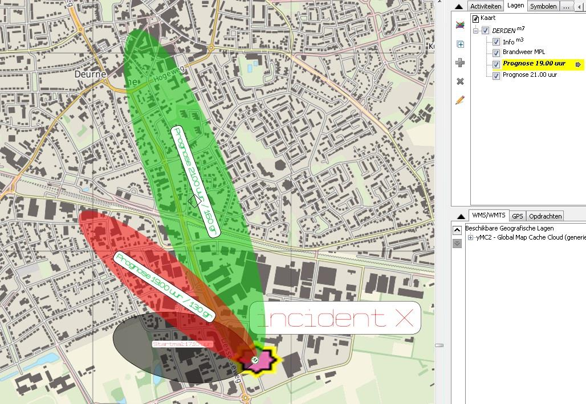

## 3.6 Het plaatsen en gebruiken van de Gasmal{.secondary}

### Doel{.secondary}
Deze instructie is bedoeld om de informatieoverdracht van MPL die voor het multidisciplinair
proces van het belang is te stroomlijnen. Gaat hier met name om de overgang van gegevens
uit programma Gasmal over te zetten in de plotapplicatie van LCMS. In LCMS zijn dezelfde
mallen opgenomen als in het programma Gasmal.

### Samenstelling{.secondary}
MeetPlanOrganisatie, bestaat uit een piket Meet Plan Leider en uit een aantal parate
meetploegen. Bij een incident waarbij (vermoedelijk) gevaarlijke stoffen zijn betrokken wordt
deze dienst gealarmeerd.

### Adviseur Gevaarlijke Stoffen{.secondary}
Deze regionale piketfunctionaris adviseert de brandweer officier van dienst of het
Commando Plaats Incident, CoPI. De AGS richt zich net als een CoPI op het brongebied.

### Meet Plan Leider{.secondary}
De (inter)regionale functionaris geeft vanuit het brandweer actiecentrum meetplan
verplaatstings- en meetopdrachten aan de meetploegen. Hiervoor wordt eerst een verwacht
effectgebied geplot, op basis van de betrokken stoffen, het geconstateerde of verwachte
scenario.

### Metingen{.secondary}
Een meetploeg kan drie soorten metingen uitvoeren: 1) Gasmeting, 2) Simultaanmeting en
3) Radiologische meting. Bij een gasmeting wordt met één of enkele zogenaamde
gasmeetbuisjes een concentratiemeting uitgevoerd. Een meetbuisje kan daarbij één of meer
soorten gevaarlijke stoffen meten. Als niet bekend is welke stoffen er vrij zijn gekomen kan
er worden gemeten met een zogenaamde simultaanmeting. Bij een gas- en simultaanmeting
wordt ook een gasdetector gebruikt voor onder andere het explosiegevaar en de
concentratie van zuurstof, koolmonoxide en enkele andere veel voorkomende stoffen.

### Advisering{.secondary}
Op basis van de interpretatie van de meetresultaten stelt de MPL een advies op voor de
operationele diensten. Dit advies bestaat onder andere uit een voorstel voor de ligging van
de verschillende effectgebieden en het eventueel alarmeren van de sirenes, NL alert om de
aanwezigen te alarmeren. Ook het handelingsperspectief voor de burger maakt hier
onderdeel van uit. De advisering vindt plaats rechtstreek aan de AC-Brandweer. Deze neemt
het advies mee in het ROT.

### Geografische informatie{.secondary}
Geografische informatie wordt doorgegeven aan de GeoInformatie medewerker ROT nadat
deze is afgestemd met de AC-B. Het is ook mogelijk dat de AC-B toestemming geeft dit
vooraf te doen. Echter in het huidige LCMS kan iedereen de plotlaag zien. (dit wordt in de
release van oktober 2014 opgelost).

### Gegevens uit Gasmal{.secondary}
Als de MPL gebruik maakt van Gasmal waar een bepaalde mal op van toepassing is, dienen
de gegevens overdragen te worden aan de GeoInformatie medewerker ROT.

Houdt rekening met volgende gegevens:
- bron incident (exact aangeven);
- windrichting;
- mal kleur;
- mal nummer;
- tijdstip;
- naam.

Elke mal moet de geo-informatie medewerker voorzien van een naam en tijdstip. Op deze
wijze is voor iedereen zichtbaar van wanneer de mal is en waar het om gaat. Dit kan
bijvoorbeeld de stofnaam zijn. Of verwachtte rooklaag etc.
Ook als de situatie niet verandert moet dit periodiek aan de geo-informatie medewerker
worden aangegeven zodat er een nieuw tijdstip bij de mal komt te staan.

### Prognoses{.secondary}
Het is goed mogelijk om in LCMS prognoses aan te geven. Hiervoor moet dezelfde
gegevens doorgegeven worden aan de GeoInformatie medewerker ROT met duidelijk in de
naam een prognose en tijdstip. In LCMS is het eenvoudig om prognoselagen aan en uit te
zetten. Dit is bijvoorbeeld van belang als de wind gaat draaien of bij escalatiescenario’s.

### Andere geografische informatie{.secondary}
Het is ook mogelijk dat er andere geografische informatie van de MPL belangrijk is voor de
multidisciplinaire plot. Als deze van de MPL afkomstig is zal deze mondeling overgebracht
moeten worden aan de GeoInformatie medewerker ROT.

