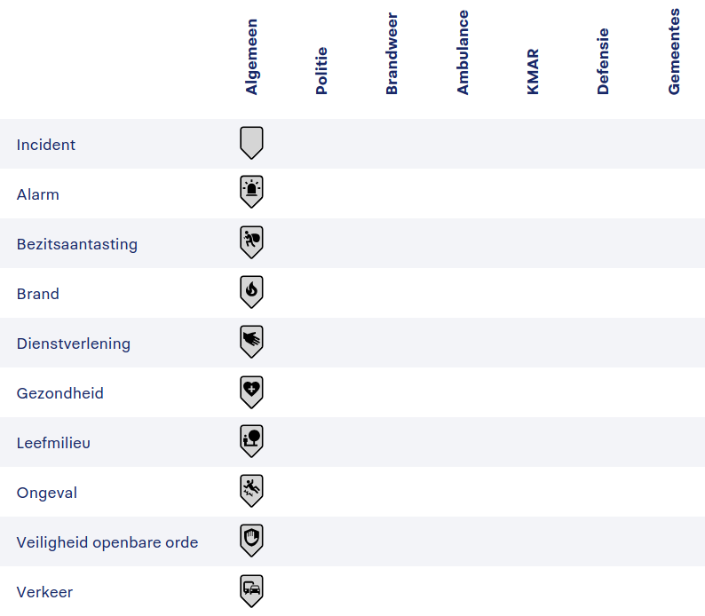
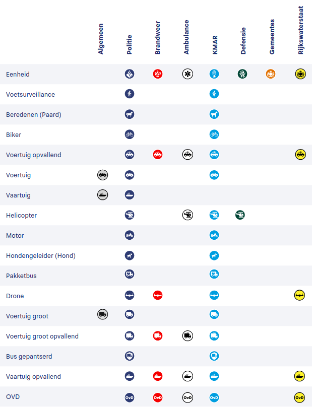
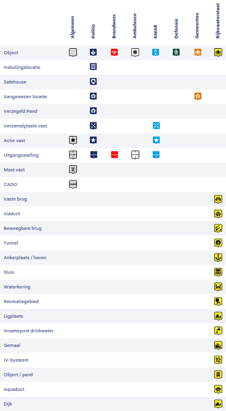
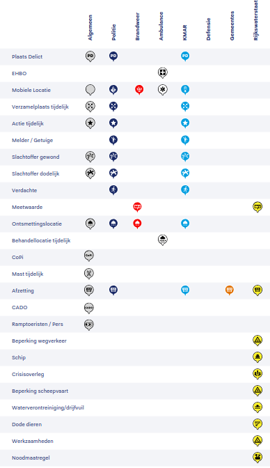

# LCMS Symboliek Plot

_voor verouderde symbolen zie [symbolenset_vorige_versie.md](symbolenset_vorige_versie.md)_

## Pointers

Middels verschillende pointers wordt een type geduid. We maken hierbij onderscheid tussen incidenten, eenheden, objecten en gebeurtenissen.

De pointers bevatten allemaal een outline om contrast op de onderliggende kaart te waarborgen. Deze outline kan zwart #000000 of wit #FFFFFF zijn.

De outline kleur is altijd gelijk aan het geplaatste icoon. De keus voor zwart of wit wordt gemaakt op basis van het optimale contrast ten opzichte van de afzender.

|Vorm|Omschrijving| 
|---|---|
||**Incident**   Symboliseert de locatie van een incident. De afzender is altijd neutraal (grijs). Een incident kan zowel met als zonder startclassificatie aangegeven worden.|
||**Eenheid**   Symboliseert de locatie van een eenheid. Dit betreft manschappen en/of voertuigen. De afzender kan zowel gekleurd als neutraal zijn. Denk hierbij aan een opvallend voertuig.|
||**Object**   Symboliseert de locatie van een object. Dit betreft een locatie die vast staat op een bepaalde punt. Denk hierbij aan een insluitingslocatie of een zendmast.|
||**Gebeurtenis**   Symboliseert de locatie van een tijdelijke gebeurtenis of actie. Denk hierbij aan een afzetting of locatie van slachtoffers.|

### Afzenders

Binnen het LCMS worden vanuit meerdere zuilen plots gemaakt. Voor iedere afzender is een eigen kleur bepaald welke gebruikt kan worden in de pointers om een desbetreffende zuil te duiden.

|Voorbeeld | Zuil en kleur code  |
|:---:|---|
||**Algemeen**   #d5d5d5 |
||**Politie**   #182866 |
||**Brandweer**   #f60000 |
||**Ambulance**   #ffffff |
||**KMAR**   #009ee0 |
||**Defensie**   #004535 |
||**Bevolkingszorg**   #e17000 |
||**Rijkswaterstaat**   #fff329 |
||**Waterschap**   #192bc2 |

### Iconen

Binnen de pointers kunnen iconen geplaatst worden om extra duiding te geven. De iconen zijn opgemaakt in 24x24px en bestaan uit 1 kleur (wit of zwart). Een aantal voorbeelden van iconen zijn hieronder te zien.

### Incidenten

Onderstaande incident pointers zijn gedefinieerd voor gebruik in LCMS.

### Eenheden

Onderstaande eenheid pointers zijn gedefinieerd voor gebruik in LCMS.

#### Aanvullende algemene Defensie eenheden

### Objecten

Onderstaande eenheid pointers zijn gedefinieerd voor gebruik in LCMS.

### Gebeurtenissen

Onderstaande gebeurtenis pointers zijn gedefinieerd voor gebruik in LCMS.

