# Symbolenset vorige versie

In LCMS Plot wordt een symbolenset gebruikt. Als uitgangspunt wordt in deze bijlage de set van het informatiemodel openbare orde en veiligheid (IMOOV) genomen. Deze set komt grotendeels overeen met de symbolen set die in LCMS beschikbaar is. Het netwerk Netcentrisch Werken zal de definitieve set van symbolen vaststellen voor het LCMS plot. De
standaard van IMOOV is bijzonder uitgebreid, maar volgens de werkgroep plot echter niet volledig. De samenwerking met het Geonovum zal hier worden gezocht om aanvullende symbolen op te nemen in het model. Voor meer informatie over de visualisatie IMOOV symbolenoverzicht wordt verwezen naar Geonovum[^10].

| Symbool klein | Symbool groot | Omschrijving |
| --- | --- | --- |
| | | Verkeer en vervoer: lucht, water, land
| | |Gevaarlijke stoffen: brandbaar, explosief, gif, nucleair
| | |Volksgezondheid: gezondheidsdreiging, ziektegolf
| | 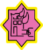|Infrastructuur: tunnels, brand, instorting, uitval
| | |Bevolking: paniek, ordeverstoring
| | |Natuur: overstroming, natuurbrand, extreem weer
| | |Brongebied
| | |Effectgebied, huidige situatie
| | |Effectgebied, prognose
| | |Beknelde personen

| Symbool klein | Symbool groot | Omschrijving |
| --- | --- | --- |
| | 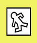| 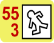  Aantal gewonden en doden _(rode getallen interactief toevoegen)_ 
| | | Risicovol object
| | | LPG
| | | Opslag gevaarlijke stoffen
| | | Ammoniak
| | | Emplacement
| | | Vervoer gevaarlijke stoffen
| | | Vuurwerk
| | | Nucleair
| | | Ontplofbare stoffen
| | | Defensie
| | | Overige gevaarlijke stof
| | | BRZO, Besluit Risico’s Zware Ongevallen

| Symbool klein | Symbool groot | Omschrijving |
| --- | --- | --- |
| | | Pijpleidingen (deels geheim!)
| | | Aandachts-locatie (geen adres)
| | 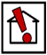| Aandachts-adres
| | | Voormalig Aandachts-adres (dit is bijvoorbeeld al ontruimd)
| | 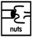| Nutsvoorziening bijvoorbeeld geknapte hoogspanningskabel
| | 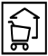| Winkel
| | 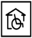| Zorginstelling incl. Ziekenhuis-dat-niet-meer-functioneert
| | | Camping/bungalowpark
| | 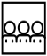| Object van maatschappelijk nut, bijvoorbeeld een museum
| | | Object van economisch nut, bijvoorbeeld een bank
| | 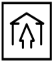| Openbaar gebouw
| | | School of Kinderopvang
| | | Hotel of Pension

| Symbool klein | Symbool groot | Omschrijving |
| --- | --- | --- |
| | | Gemaal
| | | Radarpost/Verkeersleiding
| | |   Aantal (gezonde) bewoners _(zwart getal interactief toevoegen)_
| | | Ramptoeristen
| | | Boerderij met veeteelt
| | | Viskwekerij
| | | Bedrijf met hobby-dieren _(zoals manege en hondenkennel)_
| | | Verbrand of beschadigd gebouw
| | | Verbrande natuur (bos en heide)
| | | Algemeen
| | | Gemeente
| | | Brandweer
| | | Politie

| Symbool klein | Symbool groot | Omschrijving |
| --- | --- | --- |
| | |GHOR, Geneeskundig
| | 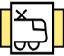| Spoorwegen
| | 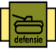| Defensie
| | 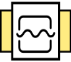| Waterschap
| | | Provincie
| | 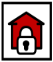| Pand dat verzegeld is
| | | Afgesloten weg
| | 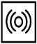| Sirene _(op vaste locatie)_
| | 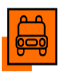| Gemeente Voertuig
| | | Brandweer Voertuig
| | | Brandweer Blusboot
| | | Brandweer Meetploeg

| Symbool klein | Symbool groot | Omschrijving |
| --- | --- | --- |
| | | Brandweer Ontsmettingssluis voertuigen
| | | Brandweer Decontaminatie (personen)
| | | Politie Voertuig
| | | Politie Plaats delict
| | | Politie Sporenonderzoek Technische Recherche
| | | Politie Wegblokkade
| | 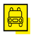| GHOR Voertuig 
| | | Evacuatiegebied, grens
| | | Evacuatieroute
| | | Evacuatie richting
| | | Extra aanvoerroutes hulpdiensten
| | | Logistiek punt _(bijvoorbeeld uitgiftepunt drinkwater)_
| | | Brandstofvoorziening voor hulpverleningsvoertuigen
| | | Gemeente Opvanglocatie

| Symbool klein | Symbool groot | Omschrijving |
| --- | --- | --- |
| | | GHOR Behandelcentrum
| | | Ziekenhuis _(functionerend)_
| | | Morgue _(identificeren van lichamen)_
| | | Verzamel Plaats Doden _(VPD)_
| | | Politie, Detentievoorziening
| | 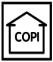| COPI, Commando Plaats Incident
| | | Gemeente, bijvoorbeeld gemeentehuis, actiecentrum
| | | Brandweer, Vaste locatie
| | | Brandweer, Mobiele / tijdelijke locatie
| | | Brandweer OVD, Officier van Dienst
| | | Brandweer CVD, Commandant van Dienst
| | | Brandweer Uitgangsstelling
| | | Brandweer Bluswatervoorziening (algemeen) brandkraan, geboorde put of open water

| Symbool klein | Symbool groot | Omschrijving |
| --- | --- | --- |
| | | Brandkraan 100 mm
| | | Brandkraan 150 mm
| | | Brandkraan 200 mm
| | | Politie, Vaste locatie
| | | Politie, Mobiele/tijdelijke locatie
| | | Politie, Officier van Dienst
| | | Politie, Werkruimte Technische Recherche
| | 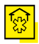| GHOR, Vaste locatie
| | 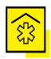| GHOR, Mobiele/tijdelijke locatie
| | 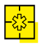| GHOR, Loodspost
| | | GHOR OVD, Officier van Dienst
| | | GHOR CVD, Commandant van Dienst
| | 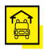| GHOR Ambulancestation

| Symbool klein | Symbool groot | Omschrijving |
| --- | --- | --- |
| | | Huisartsenpost
| | | Kazerne Defensie
| | | Beschikbaar groot gebouw
| | | Materialendepot RWS, Rijkswaterstaat
| | | Verkeersvolume
| | | Rijk
| | | Provincie
| | | Gemeente
| | | Waterschap
| | | RD kilometer grid
| | | Hoogtelijnen
| | | Bruggen en tunnels
| | | Gebouwen en bebouwd gebied

| Symbool klein | Symbool groot | Omschrijving |
| --- | --- | --- |
| | | Bos
| | | Hoofdweg
| | | Spoorlijn
| | | Water (zomerbedding)
| | | Dijkring
| | | Winterbedding (gewoon hoogwater tot aan de winterdijken)
| | | Topografische kaart [geen symbool maar een kopie van een kaartondergrond]

[^10]: [http://www.geonovum.nl/wegwijzer/standaarden/visualisatie-imoov-symbolenoverzicht-met-beschrijving](http://www.geonovum.nl/wegwijzer/standaarden/visualisatie-imoov-symbolenoverzicht-met-beschrijving)